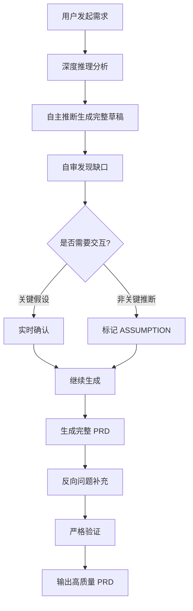

# Opc_Kit

> **专业的 AI Agent 技能工具集** — 为 OpenCode 生态打造的高质量产品工作流技能包

[](https://opensource.org/licenses/MIT)
[]()
[](https://skills.sh/sacrtap/Opc_Kit)

---

## 🎯 项目定位

Opc_Kit 是一个专为 OpenCode 生态设计的 AI Agent 技能工具集。每个技能都是经过精心设计、严格验证的专业工作流，帮助产品经理、开发者、设计师更高效地完成复杂任务。

**核心理念**：
- 📐 **结构化保证** — 强制模板和验证机制确保输出质量
- ⚡ **效率优化** — 自动推断 + 按需交互减少重复工作
- 🔗 **可追溯性** — 双向追溯机制确保每个决策都有源头
- 🎓 **专业视角** — 资深专家思维框架和行业最佳实践

---

## ✨ 功能特性

### 🎯 智能意图识别
自动识别用户意图（create/update/validate），无需手动指定工作模式。

### 🔄 双模式工作流
- **Coaching 模式（默认）** — 自主推断 → 生成完整草稿 → 自审发现缺口 → 按需交互 → 反向问题补充
- **Fast 模式** — 快速生成完整文档 → 反向问题补充缺失项

### 🔍 严格验证机制
- **第一性原理验证** — 5+ 个基础问题确保文档根基正确
- **逻辑完整性审查** — US↔FR 双向追溯、追踪↔指标追溯
- **边界与风险扫描** — 主动识别异常流程、边界条件、外部依赖

### 📝 12 章标准模板 + 3 章自动生成
- 固定骨架：问题描述、目标定义、目标用户、用户故事、功能交互流程图、详细功能列表、功能详情、追踪设计、未来改进计划、风险与依赖
- 自动生成：决策日志、术语表、假设索引

### 💡 推荐驱动交互
每次交互提供 1-3 个经过深思熟虑的推荐选项及理由，引导用户做决策而非填空。

---

## 🎯 可用技能

| 技能                              | 语言 | 用途            | 安装命令                                                    |
| --------------------------------- | ---- | --------------- | ----------------------------------------------------------- |
| [create-prd](create-prd/SKILL.md) | EN   | PRD 编写与验证  | `npx skills add sacrtap/Opc_Kit --skill create-prd`        |

## ⚡ 快速开始

### 安装

#### 方式一：通过 skills.sh（推荐）

```bash
# 安装全部技能
npx skills add sacrtap/Opc_Kit

# 安装指定技能
npx skills add sacrtap/Opc_Kit --skill create-prd

# 安装前查看可用技能列表
npx skills add sacrtap/Opc_Kit --list
```

#### 方式二：手动克隆

```bash
# 克隆仓库
git clone https://github.com/sacrtap/Opc_Kit.git

# 复制技能到项目目录
cp -r Opc_Kit/create-prd /your/project/.agents/skills/
```

### 使用

在 OpenCode 中激活技能：

```
/create-prd 创建一个用户认证功能的 PRD
```

或直接描述需求：

```
帮我写一个产品需求文档，功能是：用户可以在平台创建和分享收藏夹
```

### 工作模式切换

```
# 快速模式（跳过交互，直接生成）
fast

# Coaching 模式（按需交互，逐步完善）
coaching
```

---

## 📚 create-prd 技能详解

### 核心功能

**create-prd** 是一个专业的 PRD（产品需求文档）写作助手，提供从创建、更新到验证的完整工作流支持。

| 意图       | 功能            | 触发信号                                    |
| ---------- | --------------- | ------------------------------------------- |
| **create**   | 创建新 PRD      | "新建 PRD"、"撰写需求文档"、"创建产品需求"  |
| **update**   | 更新已有 PRD    | "更新/修改已有 PRD"、"PRD 变更"、"在现有文档上增加功能" |
| **validate** | 验证 PRD 完整性 | "验证/检查 PRD"、"审查需求文档完整性"        |

### 核心工作流

#### Coaching 模式（推荐）



#### 11 条核心原则

1. **固定模板** — 12 章骨架 + 2 章自动生成，章节顺序不可更改
2. **严格验证不可跳过** — US↔FR 双向追溯、第6章↔第7章 1:1 对应、追踪↔成功指标追溯、指标↔计算方式 1:1 追溯
3. **变更日志强制** — update 意图必须先追加变更记录
4. **流程图必须** — 至少 1 张 mermaid 流程图，核心场景独立；**API 调用/数据查询/外部依赖必须有失败+超时分支，不可只有成功路径**
5. **验收标准可测试** — 每条必须包含可量化/可执行的判断条件
6. **[ASSUMPTION] 标记强制** — 推断内容必须标记，完成后自动汇总到假设索引
7. **一次一问** — coaching 模式交互规则
8. **异常路径覆盖** — 流程图中每个 API 调用/外部依赖节点必须有成功/失败/超时三条分支，用户操作节点必须有异常路径（网络断开、权限不足、数据不存在）
9. **深度推理优先** — 生成 PRD 初稿前必须先进行深度推理分析（用户动机、商业价值、技术可行性、风险矩阵），融入 PRD 而非直接询问用户
10. **高级 PM 视角** — 以资深产品经理标准引导和思考，在问题描述、目标定义章节引入产品思维框架（Why Now、差异化、用户分层、商业价值），在风险与依赖章节提供行业最佳实践建议
11. **推荐驱动交互** — 每次互动提供 1-3 个推荐选项及理由，让用户做决策而非填空

### 使用场景

#### 场景一：创建新功能 PRD

```
用户：帮我写一个用户收藏功能的 PRD

技能：
1. 深度推理：分析用户动机、业务价值、技术可行性
2. 自主推断：生成 12 章完整草稿
3. 按需交互：关键假设实时确认（如："我假设目标用户是活跃用户，对吗？"）
4. 反向追问：非关键推断汇总（如 UI 风格偏好）
5. 严格验证：US↔FR 双向追溯、流程图异常分支检查
6. 输出：高质量可执行 PRD + 假设索引
```

#### 场景二：更新已有 PRD

```
用户：更新 docs/prd-user-auth.md，增加单点登录功能

技能：
1. 读取已有 PRD
2. 分析变更影响范围
3. 生成更新内容（保持结构一致性）
4. 追加变更日志条目
5. 运行严格验证
6. 输出：更新后的 PRD + 变更记录
```

#### 场景三：验证 PRD 完整性

```
用户：验证 docs/prd-payment.md 是否完整

技能：
1. 第一性原理验证：5+ 个基础问题
2. 逻辑完整性审查：US↔FR 双向追溯率、追踪↔指标追溯率
3. 边界与风险扫描：异常流程、边界条件、外部依赖
4. 输出：验证报告 + 质量评分（7 维度，满分 100）
```

### 核心优势

| 维度       | 传统方式             | create-prd 技能                  |
| ---------- | -------------------- | -------------------------------- |
| **结构完整性** | 依赖作者经验，易遗漏 | 强制 12 章骨架 + 双向追溯验证    |
| **质量保证**   | 无自动验证机制       | 第一性原理验证 + 边界风险扫描    |
| **效率**       | 大量填空式问答       | 推断 + 按需交互，推荐驱动决策    |
| **可追溯性**   | 功能与需求分离       | US↔FR 双向追溯，每个功能有源头   |
| **变更管理**   | 无版本记录           | 强制变更日志 + 关键更新注释      |
| **专业性**     | 普通模板             | 资深 PM 视角 + 行业最佳实践      |

---

## 🤝 贡献指南

我们欢迎高质量的技能贡献！

### 添加新技能

1. Fork 本仓库
2. 在 `.agents/skills/` 目录创建新技能文件夹
3. 按技能模板结构编写：
   - Frontmatter（name、description）
   - Identity & Memory
   - Core Mission
   - Critical Rules
   - Technical Deliverables（含示例）
   - Workflow Process
   - Success Metrics
4. 提交 PR 并附上技能使用示例

### 技能质量标准

- ✅ 固定模板 + 强制验证机制
- ✅ 推荐驱动交互（而非填空式问答）
- ✅ 双向追溯/可追溯性保证
- ✅ 专业视角 + 行业最佳实践
- ✅ 完整文档 + 使用示例

详见 [CONTRIBUTING.md](CONTRIBUTING.md)。

---

## 📄 许可证

MIT © sacrtap

---

## 💬 社区

- **GitHub Issues**: [报告问题或请求功能](https://github.com/sacrtap/Opc_Kit/issues)
- **Discussions**: [分享使用案例](https://github.com/sacrtap/Opc_Kit/discussions)

---

> **Opc_Kit** — 让 AI Agent 成为真正的产品工作流专家，而非简单的问答机器。
