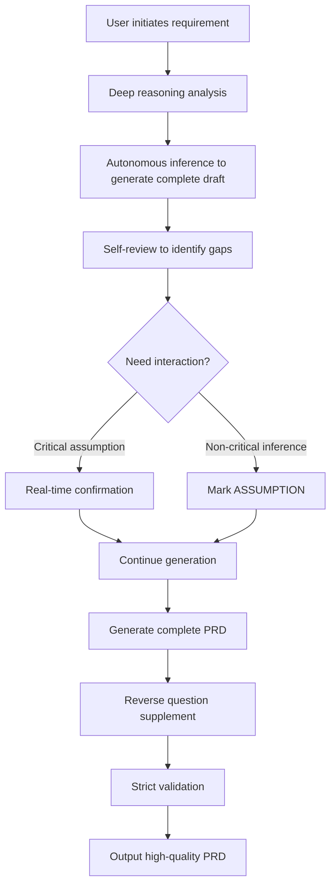

# Opc_Kit

> **Professional AI Agent Skill Toolkit** — High-quality product workflow skills for the OpenCode ecosystem

[](https://opensource.org/licenses/MIT)
[]()
[](https://skills.sh/sacrtap/Opc_Kit)

---

## 🎯 Project Positioning

Opc_Kit is an AI Agent skill toolkit designed specifically for the OpenCode ecosystem. Each skill is a meticulously designed, rigorously validated professional workflow that helps product managers, developers, and designers efficiently complete complex tasks.

**Core Philosophy**:
- 📐 **Structured Assurance** — Mandatory templates and validation mechanisms ensure output quality
- ⚡ **Efficiency Optimization** — Auto-inference + on-demand interaction reduces repetitive work
- 🔗 **Traceability** — Bidirectional traceability ensures every decision has a source
- 🎓 **Professional Perspective** — Senior expert mindset frameworks and industry best practices

---

## ✨ Feature Highlights

### 🎯 Intelligent Intent Recognition
Automatically identifies user intent (create/update/validate) without requiring manual workflow specification.

### 🔄 Dual-Mode Workflow
- **Coaching Mode (Default)** — Autonomous inference → Complete draft generation → Self-review for gaps → On-demand interaction → Reverse question supplement
- **Fast Mode** — Quick generation of complete document → Reverse question supplement for missing items

### 🔍 Strict Validation Mechanisms
- **First Principles Validation** — 5+ fundamental questions ensure document foundation correctness
- **Logical Completeness Review** — US↔FR bidirectional traceability, Tracking↔Metrics traceability
- **Boundary & Risk Scanning** — Proactively identifies exception flows, boundary conditions, external dependencies

### 📝 12-Chapter Standard Template + 3 Auto-Generated Chapters
- Fixed skeleton: Problem Description, Goal Definition, Target Users, User Stories, Feature Interaction Flowchart, Detailed Feature List, Feature Details, Tracking Design, Future Improvement Plan, Risks & Dependencies
- Auto-generated: Decision Log, Glossary, Assumption Index

### 💡 Recommendation-Driven Interaction
Each interaction provides 1-3 carefully considered recommendation options with rationale, guiding users to make decisions rather than fill in blanks.

---

## 🎯 Available Skills

| Skill                            | Language | Purpose                               | Install Command                                   |
| -------------------------------- | -------- | ------------------------------------- | ------------------------------------------------- |
| [create-prd](create-prd/SKILL.md) | EN       | Professional PRD writing & validation | `npx skills add sacrtap/Opc_Kit --skill create-prd` |

## ⚡ Quick Start

### Installation

#### Option 1: Via skills.sh (Recommended)

```bash
# Install all skills
npx skills add sacrtap/Opc_Kit

# Install specific skill
npx skills add sacrtap/Opc_Kit --skill create-prd

# List available skills before installing
npx skills add sacrtap/Opc_Kit --list
```

#### Option 2: Manual Clone

```bash
# Clone repository
git clone https://github.com/sacrtap/Opc_Kit.git

# Copy skill to your project's .agents/skills/ directory
cp -r Opc_Kit/create-prd /your/project/.agents/skills/
```

### Usage

Activate the skill in OpenCode:

```
/create-prd Create a PRD for user authentication feature
```

Or directly describe your requirement:

```
Help me write a product requirements document for: users can create and share collections on the platform
```

### Workflow Mode Switching

```
# Fast Mode (skip interaction, direct generation)
fast 

# Coaching Mode (on-demand interaction, progressive refinement)
coaching 
```

---

## 📚 create-prd Skill Deep Dive

### Core Capabilities

**create-prd** is a professional PRD (Product Requirements Document) writing assistant, providing complete workflow support from creation, update to validation.

| Intent   | Function                  | Trigger Signals                                                    |
| -------- | ------------------------- | ------------------------------------------------------------------ |
| **create**   | Create new PRD            | "New PRD", "write requirements doc", "create product requirements" |
| **update**   | Update existing PRD       | "Update/modify existing PRD", "PRD change", "add features to existing doc" |
| **validate** | Validate PRD completeness | "Validate/check PRD", "review requirements doc completeness"       |

### Core Workflow

#### Coaching Mode (Recommended)



#### 11 Core Principles

1. **Fixed Template** — 12-chapter skeleton is immutable
2. **Strict Validation Unskippable** — US↔FR bidirectional traceability, Tracking↔Metrics traceability
3. **Mandatory Change Log** — update intent must append change records
4. **Flowchart Required** — At least 1 mermaid flowchart, exception branches fully covered
5. **Acceptance Criteria Testable** — Each criterion must include quantifiable/executable judgment conditions
6. **[ASSUMPTION] Marking Mandatory** — Inferred content must be marked and summarized
7. **One Question at a Time** — coaching mode interaction rule
8. **Exception Path Coverage** — API calls must include success/failure/timeout branches
9. **Deep Reasoning First** — Analyze user motivation, business value, technical feasibility first
10. **Senior PM Perspective** — Introduce product thinking frameworks and industry best practices
11. **Recommendation-Driven Interaction** — Provide 1-3 recommendation options with rationale each time

### Usage Scenarios

#### Scenario 1: Create New Feature PRD

```
User: Help me write a PRD for user collection feature

Skill:
1. Deep reasoning: Analyze user motivation, business value, technical feasibility
2. Autonomous inference: Generate 12-chapter complete draft
3. On-demand interaction: Real-time confirmation for critical assumptions (e.g., "I assume target users are active users, correct?")
4. Reverse questions: Summarize non-critical inferences (e.g., UI style preferences)
5. Strict validation: US↔FR bidirectional traceability, flowchart exception branch check
6. Output: High-quality executable PRD + assumption index
```

#### Scenario 2: Update Existing PRD

```
User: Update docs/prd-user-auth.md, add single sign-on feature

Skill:
1. Read existing PRD
2. Analyze change impact scope
3. Generate update content (maintain structural consistency)
4. Append change log entry
5. Run strict validation
6. Output: Updated PRD + change record
```

#### Scenario 3: Validate PRD Completeness

```
User: Validate if docs/prd-payment.md is complete

Skill:
1. First principles validation: 5+ fundamental questions
2. Logical completeness review: US↔FR bidirectional traceability rate, Tracking↔Metrics traceability rate
3. Boundary & risk scanning: Exception flows, boundary conditions, external dependencies
4. Output: Validation report + quality score (7 dimensions, max 100)
```

### Core Advantages

| Dimension               | Traditional Approach                            | create-prd Skill                                                      |
| ----------------------- | ----------------------------------------------- | --------------------------------------------------------------------- |
| **Structural Completeness** | Depends on author experience, prone to omission | Mandatory 12-chapter skeleton + bidirectional traceability validation |
| **Quality Assurance**       | No automatic validation mechanism               | First principles validation + boundary risk scanning                  |
| **Efficiency**              | Extensive fill-in-the-blank Q&A                 | Inference + on-demand interaction, recommendation-driven decision     |
| **Traceability**            | Features separated from requirements            | US↔FR bidirectional traceability, every feature has a source          |
| **Change Management**       | No version records                              | Mandatory change log + key update annotations                         |
| **Professionalism**         | Generic templates                               | Senior PM perspective + industry best practices                       |

---

## 🤝 Contributing Guide

We welcome high-quality skill contributions!

### Adding New Skills

1. Fork this repository
2. Create new skill folder in `.agents/skills/` directory
3. Write following skill template structure:
   - Frontmatter (name, description)
   - Identity & Memory
   - Core Mission
   - Critical Rules
   - Technical Deliverables (with examples)
   - Workflow Process
   - Success Metrics
4. Submit PR with skill usage examples

### Skill Quality Standards

- ✅ Fixed template + mandatory validation mechanism
- ✅ Recommendation-driven interaction (not fill-in-the-blank Q&A)
- ✅ Bidirectional traceability / traceability assurance
- ✅ Professional perspective + industry best practices
- ✅ Complete documentation + usage examples

See [CONTRIBUTING.md](CONTRIBUTING.md) for details.

---

## 📄 License

MIT © sacrtap

---

## 💬 Community

- **GitHub Issues**: [Report issues or request features](https://github.com/sacrtap/Opc_Kit/issues)
- **Discussions**: [Share use cases](https://github.com/sacrtap/Opc_Kit/discussions)

---

> **Opc_Kit** — Empower AI Agents to become true product workflow experts, not simple Q&A machines.
