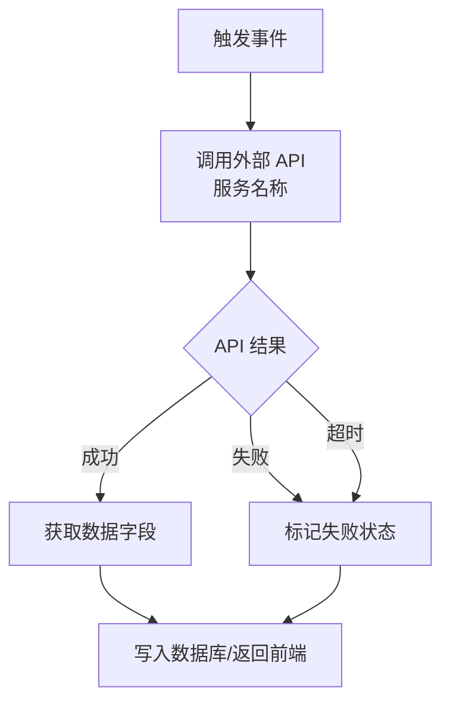
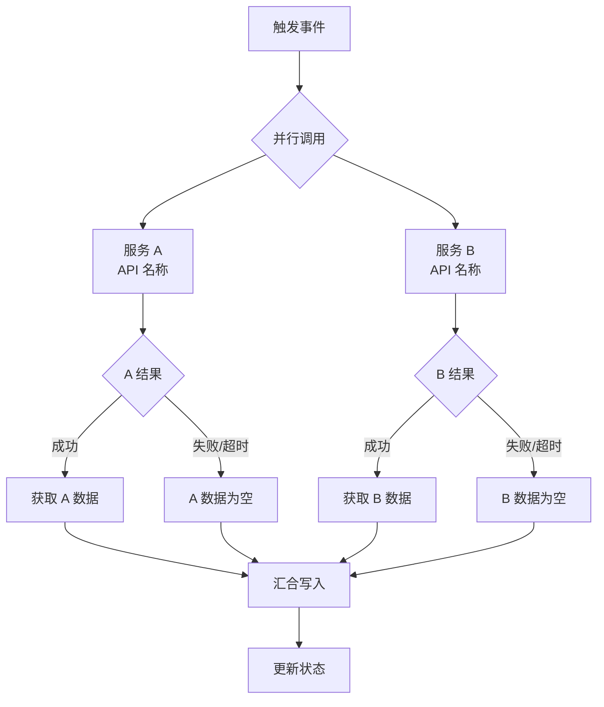
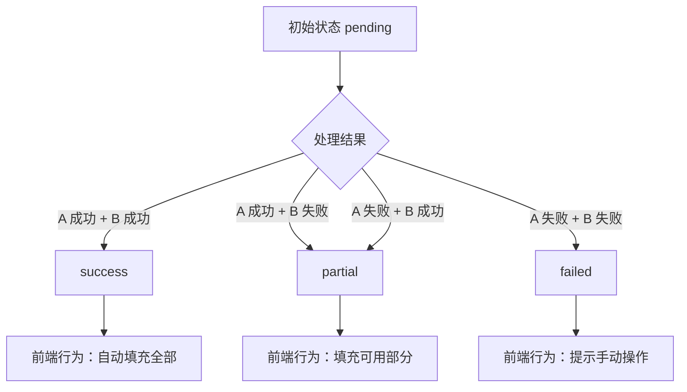
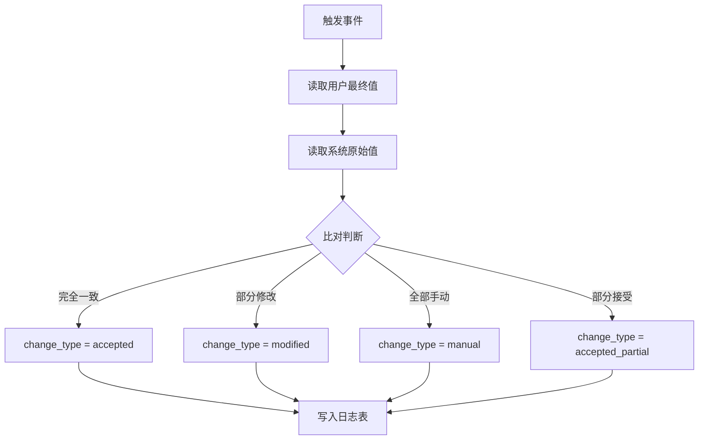

# Mermaid 流程图常用片段库

以下片段可直接复制修改，用于 PRD 第 5 章流程图。

## 片段 1：API 调用 + 判断分支

参考模式：F-2.1 GPS 逆地理编码

**要点**：
- 判断节点必须有成功/失败/超时三分支
- 超时与失败合并到同一处理路径
- 超时时间应在交互说明中定义（如 >10s）

## 片段 2：并行处理 + 汇合

参考模式：F-2.1 GPS + F-2.2 LLM 并行解析

**要点**：
- 并行分支数量不超过 4 个，超出建议拆子流程
- 汇合节点明确说明如何处理部分失败

## 片段 3：状态机流转

参考模式：parse_status 状态流转

**要点**：
- 状态值必须与数据表 ENUM 定义一致
- 每个终态对应明确的前端/后端行为

## 片段 4：数据库读写 + 条件分支

参考模式：F-2.11 变更比对写入

**要点**：
- 比对逻辑必须在交互说明中给出伪代码
- 写入操作标明表名和关键字段
