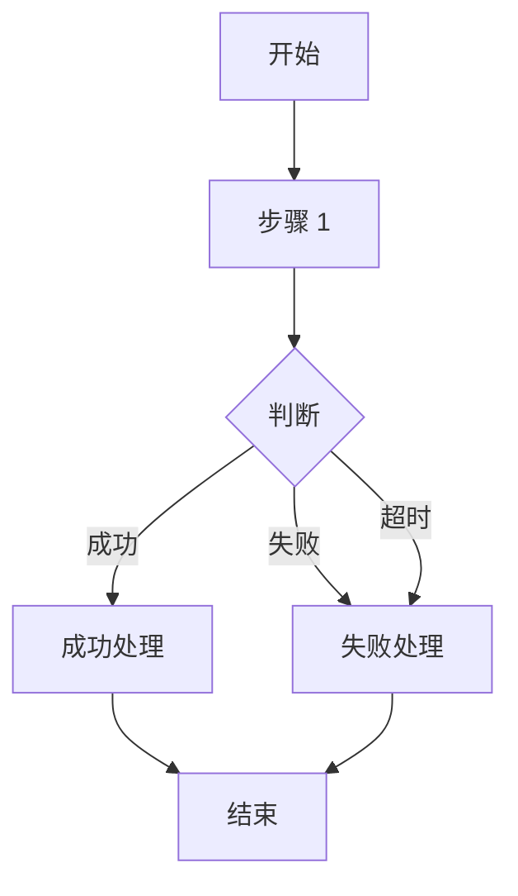

# PRD: {产品名} - {特性名}

## Metadata

| 字段 | 值 |
|------|-----|
| 作者 | {作者} |
| 状态 | Draft |
| 创建日期 | {YYYY-MM-DD} |
| 最后更新 | {YYYY-MM-DD} |
| 版本 | v1.0.0 |
| 项目 | {项目名称} |
| 关联文档 | {关联文档路径，无则填"无"} |
| 原型文件 | {原型文件路径，无则填"无"} |

## 变更记录

| 日期 | 版本 | 修改人 | 修改内容 |
|------|------|--------|---------|
| {YYYY-MM-DD} | v1.0.0 | {作者} | 初始版本创建 |

## 1. 问题描述

### 核心问题

[1-2 段话描述核心痛点，说明当前用户如何操作、存在什么问题]

### 具体问题

| # | 问题 | 用户反馈 | 严重程度 |
|---|------|---------|---------|
| 1 | {问题描述} | "{用户原话或典型反馈}" | **P0** |
| 2 | {问题描述} | "{用户原话或典型反馈}" | **P1** |

P0 问题不超过 3 条。每条问题对应一个可验证的用户痛点。

### 影响范围

- **{用户类型 1}**：{具体影响场景，高频/低频，操作链路}
- **{用户类型 2}**：{具体影响场景}

## 2. 目标定义

### 核心目标

1. **{目标 1}**：{具体描述，可量化}
2. **{目标 2}**：{具体描述}

### 成功指标

| 指标 | 当前基线 | 目标 | 测量方式 |
|------|---------|------|---------|
| {指标名} | {当前值或"N/A"} | {量化目标} | {埋点编号/调研方式} |

每个指标必须量化（不允许"提升用户体验"）。每个指标在第 8 章必须有对应埋点支撑。

## 3. 目标用户

| 用户类型 | 使用场景 | 优先级 | 核心诉求 |
|----------|----------|--------|---------|
| {用户 1} | {具体场景描述} | P0 | {核心诉求} |
| {用户 2} | {具体场景描述} | P1 | {核心诉求} |

## 4. 用户故事

| ID | 用户故事 | 验收标准 |
|----|---------|---------|
| US-{x}.{x} | 作为{角色}，我希望{行为}，以便{价值} | {对应验收标准} |

每条用户故事必须：
- 使用"作为...我希望...以便..."句式
- 有对应验收标准
- 能在第 7 章某个 F-x.x 中被实现（双向追溯）

## 5. 功能交互流程图

### 5.1 {场景 1 名称}

### 5.2 {场景 2 名称}

[按业务场景拆分，每张图 8-20 个节点]

## 6. 详细功能清单

| 编号 | 功能模块 | 功能名称 | 优先级 | 说明 |
|------|---------|---------|--------|------|
| F-{x}.{x} | {模块名} | {功能名} | P0/P1/P2 | {一句话说明} |

**优先级定义：**
- **P0（核心/阻塞）**：不做则功能不可用，v1 必须交付
- **P1（重要）**：用户体验显著受影响，v1 应尽量交付
- **P2（锦上添花）**：有更好，没有也不影响核心链路

编号格式：`F-{大版本号}.{序号}`，如 `F-2.1`。
每个 F-x.x 必须在第 7 章有同名详述章节（1:1 对应）。

## 7. 各详细功能说明

### F-{x}.{x} {功能名}

**功能描述**：{一句话描述功能做什么}

**触发时机**：{何时触发/在什么场景下执行}

**交互说明**：
- {交互步骤 1}
- {交互步骤 2}
- {状态变化/数据流转}

**场景行为**：（可选，适用于多状态场景）

| 场景 | 行为 |
|------|------|
| {条件 A} | {行为描述} |
| {条件 B} | {行为描述} |

**验收标准**：
- [ ] {可测试条件 1，含量化阈值或可执行验证语句}
- [ ] {可测试条件 2}

## 8. 埋点设计

### 8.1 埋点说明

埋点统计平台：{平台名称，如"神策数据"}

### 8.2 埋点功能清单

| 埋点编号 | 事件名称 | 触发时机 | 对应成功指标 | 关键业务字段 |
|---------|---------|---------|------------|------------|
| BT-{x}.{x} | {事件名} | {触发时机} | {对应指标} | {字段列表} |

每条埋点必须服务于第 2 章至少一个成功指标。

### 8.3 成功指标计算方式

| 成功指标 | 计算方式 | 使用埋点 |
|---------|---------|---------|
| {指标名} | {计算公式} | {BT-x.x} |

每个成功指标必须有计算方式说明。

### 8.4 CSAT 调研方案（可选）

| 维度 | 说明 |
|------|------|
| 调研时机 | {上线后第 N 天} |
| 调研方式 | {问卷/访谈} |
| 目标样本量 | N≥{数量} |
| 调研对象 | {目标用户} |
| 核心问题 | "{问题文案}" |

## 9. 未来改进计划

| 编号 | 改进项 | 原因 | 优先级 | 预计迭代 |
|------|--------|------|--------|---------|
| F-{x}.{x+1} | {改进项描述} | {原因} | P1/P2 | {版本号} |

编号必须延续主功能编号（如本期最后 F-2.12，下期从 F-2.13 开始）。

## 10. 风险与依赖

### 10.1 技术风险

| 风险编号 | 风险描述 | 影响程度 | 缓解措施 |
|---------|---------|---------|---------|
| R-{x} | {风险描述} | 高/中/低 | {缓解方案} |

### 10.2 外部依赖

| 依赖编号 | 依赖项 | 依赖方 | 影响 | 排期状态 |
|---------|--------|--------|------|---------|
| D-{x} | {依赖项} | {依赖方} | {影响描述} | 待对接/待评审/待确认/已确认/已完成/已阻塞 |

每条依赖必须有"排期状态"字段。

### 10.3 已知限制

| 限制编号 | 限制描述 | 影响范围 | 解决计划 |
|---------|---------|---------|---------|
| L-{x} | {限制描述} | {影响范围} | {解决计划} |

## 11. 术语表

| 术语 | 定义 | 首次出现章节 |
|------|------|-------------|
| {术语 1} | {定义。与其他术语的关系（如适用）} | 第 X 章 |
| {术语 2} | {定义} | 第 X 章 |

跨章节出现 ≥2 次的领域名词必须在此定义。禁止同义词替换，全文术语必须字面一致。

## 12. 假设索引

| 编号 | 出处章节 | 假设内容 | 状态 |
|------|---------|---------|------|
| A-1 | {章节} | {假设描述} | 待确认 |
| A-2 | {章节} | {假设描述} | 待确认 |

所有 `[ASSUMPTION: xxx]` 标签必须汇总到此表。状态：待确认 / 已确认 / 已否定。
