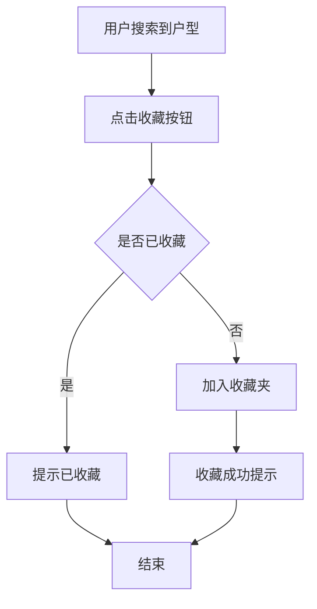
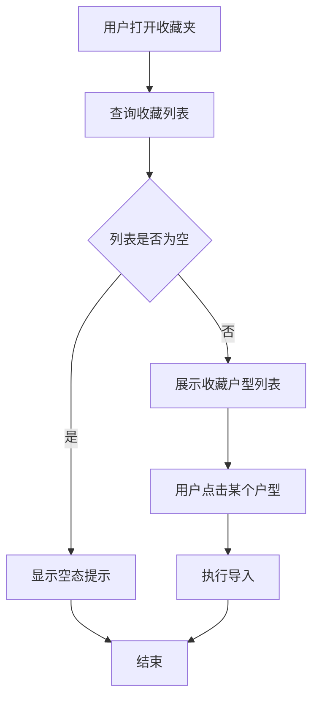

# PRD: 户型图工具 - 户型图收藏夹

## Metadata

| 字段 | 值 |
|------|-----|
| 作者 | Sam Tan |
| 状态 | Draft |
| 创建日期 | 2026-05-22 |
| 最后更新 | 2026-05-22 |
| 版本 | v1.0.0 |
| 项目 | 户型图工具【收藏夹功能】 |
| 关联文档 | 无 |
| 原型文件 | 无 |

## 变更记录

| 日期 | 版本 | 修改人 | 修改内容 |
|------|------|--------|---------|
| 2026-05-22 | v1.0.0 | Sam Tan | 初始版本创建 |

## 1. 问题描述

### 核心问题

当前户型图工具每次搜索户型都需要重新选择省市和小区名，经纪人高频使用的户型图无法快速复用，平均每次搜索花费 1-2 分钟。

### 具体问题

| # | 问题 | 用户反馈 | 严重程度 |
|---|------|---------|---------|
| 1 | 高频户型无法快速复用，每次重新搜索 | "每天都要搜同样的几个小区" | **P0** |
| 2 | 搜索操作链路长（省市→小区→选择） | "选半天，浪费时间" | **P0** |
| 3 | 不同经纪人之间无法共享常用户型 | "同事用过的好户型我找不到" | **P1** |

### 影响范围

- **经纪人**：高频使用场景，每天搜索 10-20 次户型，重复操作耗时
- **众趣外包编辑**：需要搜索不同区域户型，常用户型无法快速定位

## 2. 目标定义

### 核心目标

1. **收藏夹功能**：经纪人可收藏常用户型图，下次一键调用
2. **减少操作步数**：从收藏夹调用户型从 4 步降至 1 步

### 成功指标

| 指标 | 当前基线 | 目标 | 测量方式 |
|------|---------|------|---------|
| 平均搜索操作步数 | 4 步 | ≤1 步（从收藏夹调用） | 埋点统计 |
| 收藏夹使用率 | N/A | >60% 活跃用户使用 | 埋点统计 |
| 收藏户型复用率 | N/A | >70% 收藏户型被再次使用 | 埋点统计 |

## 3. 目标用户

| 用户类型 | 使用场景 | 优先级 | 核心诉求 |
|----------|----------|--------|---------|
| 经纪人 | 每天搜索相同小区户型，希望一键调用 | P0 | 快速复用、一键收藏 |
| 众趣外包编辑 | 需要搜索不同区域户型 | P1 | 分类管理、快速查找 |

## 4. 用户故事

| ID | 用户故事 | 验收标准 |
|----|---------|---------|
| US-1.1 | 作为经纪人，我希望搜索到户型后可以点击收藏，下次在收藏夹中一键调用 | 收藏按钮可见，点击后收藏成功 |
| US-1.2 | 作为经纪人，我希望在收藏夹中看到已收藏的户型列表，点击即可导入 | 列表展示正常，点击导入成功 |
| US-1.3 | 作为经纪人，我希望可以取消收藏不需要的户型 | 取消收藏功能正常 |

## 5. 功能交互流程图

### 5.1 收藏流程

### 5.2 收藏夹调用流程

## 6. 详细功能清单

| 编号 | 功能模块 | 功能名称 | 优先级 | 说明 |
|------|---------|---------|--------|------|
| F-1.1 | 前端交互 | 收藏按钮 | P0 | 搜索结果页显示收藏按钮 |
| F-1.2 | 前端交互 | 收藏夹列表页 | P0 | 展示已收藏户型列表 |
| F-1.3 | 前端交互 | 取消收藏 | P1 | 从收藏夹移除户型 |
| F-1.4 | 后端服务 | 收藏数据存储 | P0 | 存储用户收藏关系 |

## 7. 各详细功能说明

### F-1.1 收藏按钮

**功能描述**：在搜索结果页每个户型卡片旁显示收藏按钮。

**触发时机**：用户搜索到户型结果后。

**交互说明**：
- 每个户型卡片右侧显示星形收藏按钮
- 未收藏状态：空心星形，hover 显示"收藏"tooltip
- 已收藏状态：实心星形（金色），hover 显示"已收藏"tooltip
- 点击收藏：调用后端接口，成功后变为实心星形，显示"已收藏"提示条
- 点击已收藏：取消收藏，调用后端接口，成功后变为空心星形

**验收标准**：
- [ ] 收藏按钮在搜索结果页每个户型卡片旁可见
- [ ] 未收藏/已收藏状态视觉区分明显
- [ ] 点击收藏后 1 秒内完成状态切换
- [ ] 收藏成功提示条显示 2 秒后自动消失

### F-1.2 收藏夹列表页

**功能描述**：展示用户已收藏的户型列表。

**触发时机**：用户点击侧边栏"收藏夹"Tab。

**交互说明**：
- 按收藏时间倒序排列
- 每个条目显示：户型缩略图、小区名、户型名称、收藏时间
- 空态：显示"暂无收藏，搜索户型后点击星形即可收藏"
- 点击条目：执行导入操作

**验收标准**：
- [ ] 收藏夹列表按收藏时间倒序排列
- [ ] 每个条目信息完整（缩略图/小区名/户型名/时间）
- [ ] 空态提示友好
- [ ] 点击条目导入成功

### F-1.3 取消收藏

**功能描述**：从收藏夹中移除已收藏的户型。

**触发时机**：用户在收藏夹中点击取消收藏按钮。

**交互说明**：
- 每个收藏条目右侧显示"取消收藏"按钮（垃圾桶图标）
- 点击后弹出确认弹窗："确定取消收藏该户型？"
- 确认后调用后端接口，成功后从列表移除

**验收标准**：
- [ ] 取消收藏按钮可见
- [ ] 确认弹窗正常显示
- [ ] 确认后从列表移除
- [ ] 搜索结果页对应户型变为未收藏状态

### F-1.4 收藏数据存储

**功能描述**：后端存储用户与户型的收藏关系。

**触发时机**：用户点击收藏/取消收藏时。

**交互说明**：
- 新增 user_favorite_floorplan 表
- 字段：id, user_id, floorplan_id, community_name, created_at
- 联合唯一索引：(user_id, floorplan_id)
- 查询接口：GET /api/floorplan/favorites?user_id={user_id}

**验收标准**：
- [ ] user_favorite_floorplan 表创建成功
- [ ] 联合唯一索引生效
- [ ] 收藏/取消收藏接口响应时间 P95 <500ms
- [ ] 查询接口返回正确排序的收藏列表

## 8. 埋点设计

### 8.1 埋点说明

埋点统计平台：神策数据（Sensors Analytics）

### 8.2 埋点功能清单

| 埋点编号 | 事件名称 | 触发时机 | 对应成功指标 | 关键业务字段 |
|---------|---------|---------|------------|------------|
| BT-1.1 | `favorite_add` | 用户点击收藏按钮成功时 | 收藏夹使用率 | user_id, floorplan_id, community_name |
| BT-1.2 | `favorite_remove` | 用户取消收藏成功时 | 收藏夹使用率 | user_id, floorplan_id |
| BT-1.3 | `favorite_list_open` | 用户打开收藏夹 Tab 时 | 收藏夹使用率 | user_id, favorite_count（当前收藏数） |
| BT-1.4 | `favorite_import` | 用户从收藏夹点击导入时 | 收藏户型复用率 | user_id, floorplan_id, days_since_favorite |

### 8.3 成功指标计算方式

| 成功指标 | 计算方式 | 使用埋点 |
|---------|---------|---------|
| 收藏夹使用率 | 使用过收藏夹的去重用户数 / 总活跃用户数 | BT-1.3（去重 user_id） |
| 收藏户型复用率 | 被导入过的收藏户型数 / 总收藏户型数 | BT-1.4（去重 floorplan_id） |

## 9. 未来改进计划

| 编号 | 改进项 | 原因 | 优先级 | 预计迭代 |
|------|--------|------|--------|---------|
| F-1.5 | 收藏夹分类管理 | 收藏数量多时难以查找 | P1 | v1.1 |
| F-1.6 | 收藏夹搜索 | 快速定位已收藏户型 | P1 | v1.1 |
| F-1.7 | 收藏夹分享 | 团队成员间共享常用户型 | P1 | v1.2 |

## 10. 风险与依赖

### 10.1 技术风险

| 风险编号 | 风险描述 | 影响程度 | 缓解措施 |
|---------|---------|---------|---------|
| R-1 | 收藏数据量增长导致查询变慢 | 中 | 添加分页，单页 20 条，索引优化 |
| R-2 | 用户误操作取消收藏 | 低 | 确认弹窗 + 操作日志可恢复 |

### 10.2 外部依赖

| 依赖编号 | 依赖项 | 依赖方 | 影响 | 排期状态 |
|---------|--------|--------|------|---------|
| D-1 | 神策数据埋点接入 | 数据团队 | 埋点需数据团队配合配置 | 已确认 |
| D-2 | 数据库表结构变更 | DBA/后端 | 新增 user_favorite_floorplan 表 | 待评审 |

### 10.3 已知限制

| 限制编号 | 限制描述 | 影响范围 | 解决计划 |
|---------|---------|---------|---------|
| L-1 | 本期不支持收藏夹分类 | 收藏数量多的用户 | 已列入 F-1.5，v1.1 增加 |
