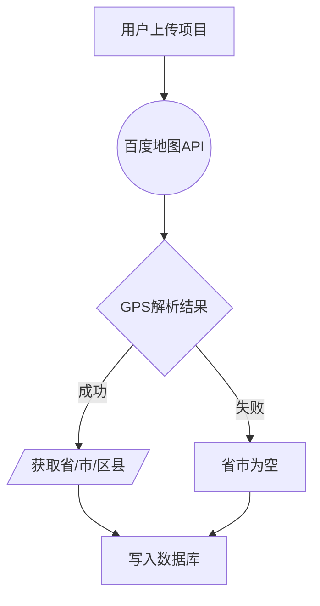
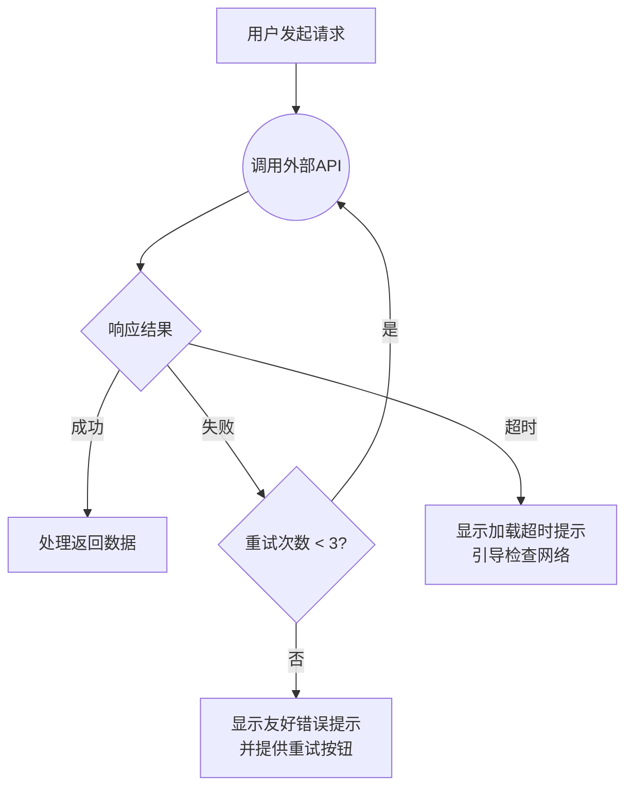
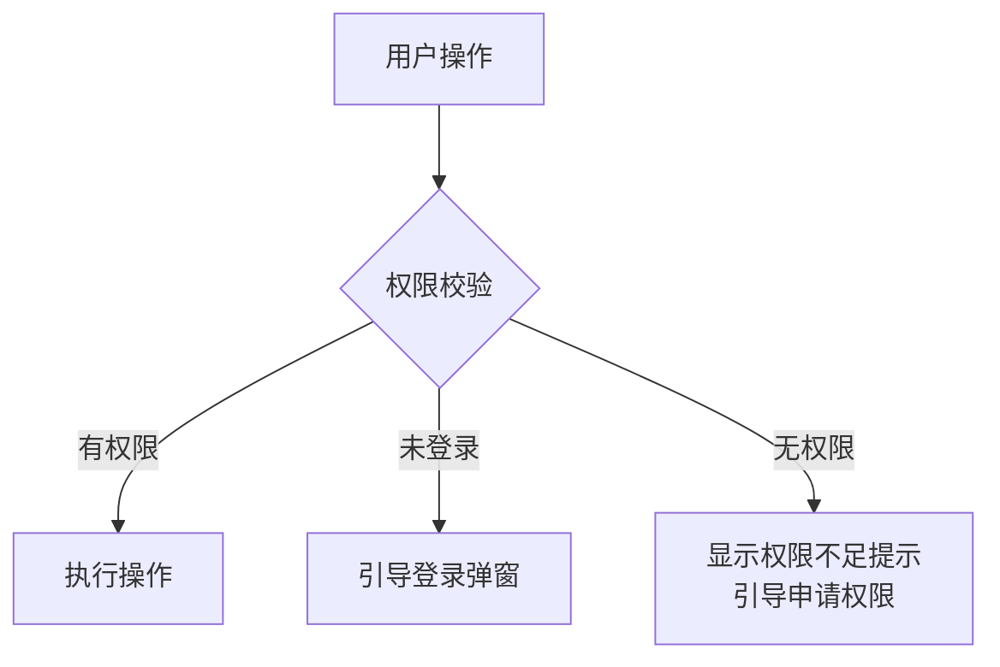
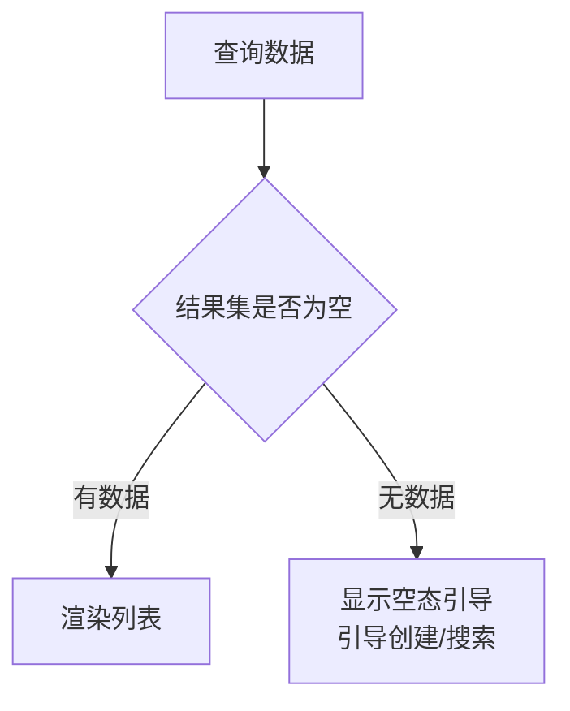
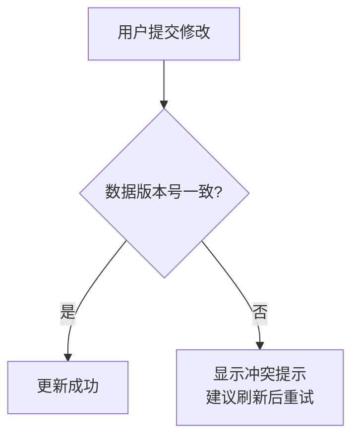
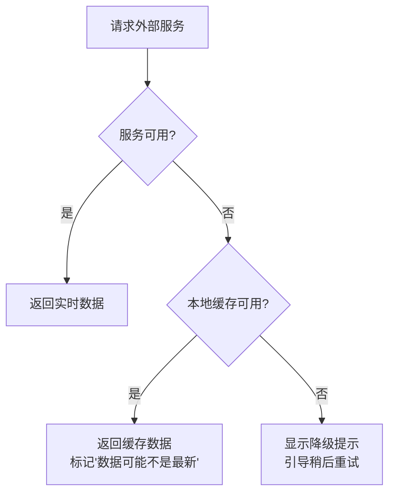

# 流程图生成规则

## 强制要求

- 每个 PRD **至少 1 张** mermaid 流程图
- 每个核心业务场景**独立一张图**
- 统一使用 `flowchart TD`（自上而下方向）

## 拆分粒度

| 规则 | 说明 |
|------|------|
| 单图节点数 | **8-20 个** |
| 超出 20 个 | 必须拆分为子流程图 |
| 少于 5 个 | 提示可能过于简略，建议合并或补充细节 |
| 拆分依据 | 按"业务场景/数据流向"拆分，不按功能模块拆分 |

**为什么 8-20**：少于 8 个节点通常可以合并到主流程；多于 20 个节点可读性急剧下降，评审难以理解。

## 节点形状语义化

| 形状 | Mermaid 语法 | 用途 |
|------|-------------|------|
| 矩形 | `[文案]` | 起点/终点/普通处理步骤 |
| 菱形 | `{文案}` | 判断节点（成功/失败/超时分支） |
| 圆形 | `((文案))` | 外部 API 调用 |
| 平行四边形 | `[/文案/]` | 数据输入/输出 |

**示例**：


## 判断节点规则

每个判断节点必须有明确的分支：

| 分支类型 | 何时必须 | 示例 |
|---------|---------|------|
| 成功 | 始终 | `-->|成功|` |
| 失败 | 适用时（API 调用、数据查询） | `-->|失败|` |
| 超时 | 适用时（有超时控制的外部调用） | `-->|超时|` |

**为什么**：PRD 的流程图必须覆盖异常路径，否则开发不知道失败时如何处理。

## 多行节点文案

使用 `<br/>` 分隔标题和说明：

```
[GPS逆地理编码<br/>百度地图API]
[LLM房源名称解析<br/>通义千问API]
[查询 project_location_parse 表<br/>缓存未命中]
```

**为什么**：单行文案信息量不足，两行格式同时说明"做什么"和"用什么做"。

## 状态值对齐规则

流程图中的状态值/枚举值必须与第 7 章数据表字段定义一致：

| 校验项 | 方法 |
|--------|------|
| parse_status 枚举值 | 流程图中的 success/partial/failed/pending 必须与数据表 ENUM 一致 |
| gps_status 枚举值 | 流程图中的 success/failed/timeout 必须与数据表 ENUM 一致 |
| 字段名引用 | 流程图引用的字段名（如 project_id、community_name）必须与数据表一致 |

**校验方法**：生成流程图后，grep 第 7 章数据表 ENUM 定义，与流程图标签交叉比对。

## 边的标签格式

分支判断用 `-->|条件|` 格式：

```
C -->|成功| D[成功处理]
C -->|失败| E[失败处理]
C -->|超时| E
```

非分支的普通流转不带标签：
```
A --> B
B --> C
```

## 生成时机

| 意图 | 行为 |
|------|------|
| create | 一次性生成所有流程图，逐张要求用户确认 |
| update | 若功能链路变化，主动询问是否需要更新对应流程图 |
| validate | 检查现有流程图是否符合规则 |

## 常见异常模式模板

Web 应用常见异常路径参考，生成流程图时直接套用：

### 1. 网络异常 → 重试 → 失败友好提示



### 2. 权限不足 → 拦截 → 引导



### 3. 数据不存在 → 空态引导



### 4. 并发冲突 → 乐观锁 → 冲突提示



### 5. 外部依赖不可用 → 降级 → 缓存兜底



## 常见错误

| 错误 | 正确做法 |
|------|---------|
| 使用 `graph TD` | 使用 `flowchart TD`（新版语法） |
| 判断节点只有成功分支 | 补充失败/超时分支 |
| 节点文案过长 | 使用 `<br/>` 分行，或拆分节点 |
| 状态值与数据表不一致 | 生成后交叉校验 |
| 单图超过 20 个节点 | 拆分为子流程图 |
