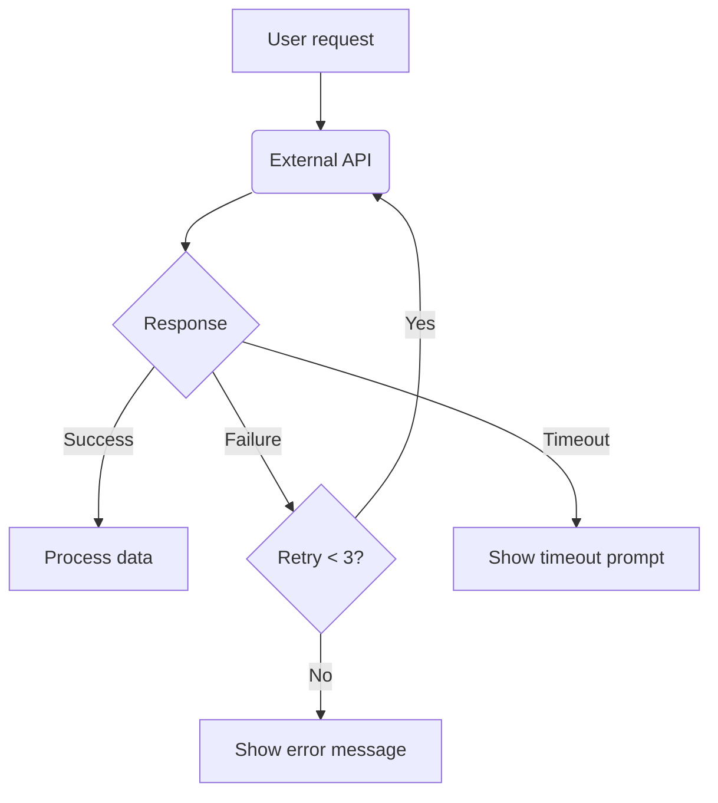

# Create PRD

## FIRST ACTION — Write the PRD file immediately

Write the complete PRD to `docs/spec/{filename}.md` where `{filename}` is auto-generated from the user's request (see naming rules below). Do NOT ask the user where to save or what to name it — pick the best name and write.

**SINGLE-WRITE MANDATE**: Write ALL content (Metadata + all 13 chapters + Review Record) in ONE operation. Use a single Bash heredoc or Write tool call. NEVER use sequential Edit calls or multiple `cat >>` appends.

**SKELETON-FIRST**: Every mode writes a complete skeleton with ACTUAL content (IDs, flowcharts, tables, `- [ ]` criteria). No `...` placeholders. The output must pass all verification checks immediately.

**Speed targets**: Coaching <30s. Fast/Update/Batch/Recovery <120s. Validate <60s. Write and stop.

**Allowed before first write**: Only `cat` existing PRD files (for update/validate modes that need a baseline). No other bash, no reading `references/*` or trajectory/logs.

## Output Path & File Naming

### Default Output Path
Always write the PRD file to `docs/spec/` directory (relative to project root). If the directory doesn't exist, create it.

**Why**: Standardized location makes PRDs discoverable by the whole team. Consistent path means tooling (linters, review bots, search) can find them without configuration.

### File Naming Rules

Generate the filename automatically — **do NOT ask the user for a filename unless they explicitly want to customize it**.

**Priority order for deriving the name:**

1. **User-specified filename** — if the user explicitly gives a filename or path, use it directly.
2. **Feature/product name** — extract the core feature/product name from the user's request and convert to kebab-case.
3. **Keyword extraction** — pull 2-4 key nouns from the request, join with hyphens.

**Format**: `{kebab-name}-prd.md`

**Examples:**

| User input | Generated filename |
|-----------|-------------------|
| "Create PRD for floor plan favorites feature" | `floor-plan-favorites-prd.md` |
| "为微信小程序户型图浏览功能写PRD" | `mini-program-floor-plan-browse-prd.md` |
| "Update auth PRD, add SSO" | `auth-sso-prd.md` (or use existing filename if provided) |
| "Validate docs/specs/payment.md" | (read existing, no new file) |

**Rules:**
- Always lowercase, kebab-case, `.md` suffix
- Keep it short: 3-6 words, under 60 characters
- No dates in the filename (version is in the Metadata table)
- No version numbers in the filename (version is in the Metadata table)
- Write to `docs/spec/{filename}.md` using `cat >` or Write tool
- If you're not sure, pick the most descriptive name and go with it — it's easy for the user to rename later

### Write Target

- Write the complete PRD to `docs/spec/{filename}.md`.
- In Coaching mode: write the coaching message, and include the proposed filename in the coaching response.

## Mode Dispatch

| Trigger | Mode | First Write Content |
|---------|------|---------------------|
| *(default, no keywords)* | **Coaching** | `## Coaching Session: {topic}\n\nv1.0.0\n\n{1-sentence scope guess}\n\n**One question:** ...` Max 3 `?` marks. ONE question. No PRD chapters. <30s. |
| "fast"/"skip"/"just generate"/"don't ask" | **Fast** | ONE Write: Metadata + ALL 13 chapters with ACTUAL content (F-x.x, mermaid, tables). Max 2 Edits after. <120s total. |
| "update"/"modify"/"add feature" | **Update** | ONE Write: Metadata (v1.1.0) + Changelog + Key Update Notes + full 13-chapter skeleton with content. Max 2 Edits after. <120s total. |
| "validate"/"check"/"review" | **Validate** | `# PRD Validation Report\n\n**Score: X/10**\n\n## Critical\n\n\n## Warning\n\n## Info\n\n## Traceability\n` <60s. |
| "resume"/"recover"/"continue" | **Recovery** | ONE Write: `## Resuming from Chapter 4` + Ch 4-13 with ACTUAL content (F-x.x, mermaid). Max 1 Edit after. <120s total. |
| "batch"/"incremental"/"progress" | **Batch** | ONE Write: ALL `✅ Batch 1/5`–`✅ Batch 5/5` markers + Metadata + ALL 13 chapters with content. Max 2 Edits after. <120s total. |

### Coaching Mode Details
- **<30s MAX.** Write immediately. Do NOT analyze deeply. Do NOT read references.
- Detect language (Chinese/English), infer context from user message
- **Must explicitly state intent**: e.g. "Looks like you want to create a new PRD — I'll guide you through it" (include "create"/"update"/"validate" keyword explicitly)
- Ask ONE consolidated question (max 3 `?` marks total), with 2-3 recommended options + brief rationale for each
- Must include "coaching" or "guide" keyword
- Must include version "v1.0.0"
- Must include a **pre-filled Metadata table** (even with inferred values — show the user what you plan to use)
- Must include the **proposed filename**
- Do NOT generate full PRD chapters (no `## 1. Problem Description` + `## 2. Goal Definition` together)
- Target output: 800-1200 chars. Write and stop.

### Fast Mode Details
- **SINGLE WRITE**: ONE Bash heredoc with Metadata + ALL 13 chapters with ACTUAL content. NO sequential Edits. NO post-write edits.
- **Ch6↔Ch7 1:1 MATCH (NON-NEGOTIABLE)**: Every `F-x.x` you list in Chapter 6 Feature List MUST have a corresponding `### F-x.x` section in Chapter 7 Feature Details. If you can't expand all, **LIST FEWER in Ch6** — keep 1:1, no gaps. Prefer 5-8 core features (P0+P1) fully expanded over 15+ features half-done.
- **Acceptance criteria MUST use `- [ ]` checkbox format.**
- Include: `## Review Record` with `### First Principles Validation`
- `[ASSUMPTION]` tags on guesses  
- Score at end: `Score: XX/100`
- Total time: <120s.
- **Conciseness**: ALL 13 chapters (Ch1-Ch13) MUST be present and follow the standard template. Each feature detail (Ch7) max 5 lines. Each user story (Ch4) max 2 lines. Keep flowcharts 8-12 nodes. Target: 200-350 lines. NEVER exceed 400 lines.

### Update Mode Details
- If eval provides a file path, `cat` it to get baseline PRD before writing. ONLY cat the baseline, do NOT read references/*.
- **SINGLE WRITE**: ONE Bash heredoc with Metadata (v1.1.0) + Changelog + Key Update Notes + full 13 chapters with content. NO sequential Edits. NO post-write edits.
- Version bump rules: feature addition → v1.1.0, major changes → v2.0.0
- Must include: `## Changelog` table (`| Date | Version | Author | Changes |`), "Key Update Notes" section (2-3 sentences max), change impact analysis (brief)
- Continue F-x.x numbering from baseline's max
- **Ch6↔Ch7 1:1 MATCH (NON-NEGOTIABLE)**: Every `F-x.x` in Chapter 6 (existing + new) MUST have a corresponding `### F-x.x` in Chapter 7. New features get full expansions. If you add too many to fit, add fewer — keep 1:1.
- **Acceptance criteria MUST use `- [ ]` checkbox format.**
- **Baseline cleanup pass**: Before writing, scan the baseline and carry fixes into the updated PRD: (a) fuzzy words (friendly / normally / correctly / 正常 / 适当 etc.) — replace with specific, measurable language; (b) User Stories missing the "so that" benefit clause — add one.
- Include `## Review Record`: First Principles Validation (1 line per item) + `**Score**: XX/100`. No per-chapter traceability audit — compute the score from the content you just wrote.
- Mermaid flowcharts must have `|Failure|` and `|Timeout|` branches
- **Conciseness**: ALL 13 chapters (Ch1-Ch13) MUST be present. Each feature detail (Ch7) max 5 lines. Keep flowcharts 8-12 nodes. Tag every assumption with `[ASSUMPTION]`. Keep total <450 lines.
- **No post-write validation**: Do NOT run validate-prd.js, do NOT re-read the file, do NOT run wc/grep on it. ONE write, then stop.
- Target: 250-450 lines. Total <120s.

### Validate Mode Details
- **<60s total.** Read baseline, write report immediately. ONE write, then stop.
- Include **Critical**, **Warning**, **Info** severity levels
- **Check only structure** (fast scan, no deep analysis): US↔F-x.x traceability, acceptance criteria format (`- [ ]`), flowchart syntax
- Output **Overall Score** (e.g., "Score: 7.5/10")
- **Speed rules**: Skip semantic checks (US benefit clause, fuzzy words, keyword correlation). Skip flowchart state alignment. Skip retry/degradation checks. Max 3 items per severity level. Keep report ≤50 lines.
- ONE write. No re-read. No validation script runs. Write and stop.

### Recovery Mode Details
- **SINGLE WRITE**: ONE Bash heredoc with ALL chapters 4-13 headings + ACTUAL content (F-x.x, mermaid, tables). NO sequential Edits. NO `...` placeholders.
- Write "Resuming from Chapter 4" as opening line
- Include checkpoint reference, batch progress markers (`✅ Batch N/5`)
- **Ch6↔Ch7 1:1 MATCH (NON-NEGOTIABLE)**: Every `F-x.x` in Ch6 must have a `### F-x.x` in Ch7. List fewer features rather than leave gaps.
- **Acceptance criteria MUST use `- [ ]` checkbox format.**
- Must include: flowchart with `|Failure|`+`|Timeout|`, Review Record
- Target: 150-250 lines total. NEVER exceed 300 lines

### Batch Mode Details
- **SINGLE WRITE**: ALL content in ONE Bash heredoc. Include actual content (F-x.x IDs, mermaid flowcharts, tables), NOT `...` placeholders. NO sequential Edits. NO multiple appends.
- Progress format: `✅ Batch 1/5` … `✅ Batch 5/5` — include ALL markers in the single write
- Includes: Metadata, all 13 chapter headings with content, flowchart with `|Failure|`+`|Timeout|`, Review Record, Score
- **Ch6↔Ch7 1:1 MATCH (NON-NEGOTIABLE)**: Every `F-x.x` in Chapter 6 MUST have a corresponding `### F-x.x` in Chapter 7. Keep Ch6 to 5-8 core features (P0+P1) — put P2 items in Future Plans instead. Better 6 fully expanded than 20 half-written.
- **Acceptance criteria MUST use `- [ ]` checkbox format.**
- Target: 250-400 lines total. NEVER exceed 400 lines
- End with: `Score: XX/100` or `Quality: XX/100`

## PRD Template (13 Chapters)

### Metadata (always include)

| Field        | Value        |
| ------------ | ------------ |
| Author       | {inferred}   |
| Status       | Draft        |
| Created      | {today}      |
| Last Updated | {today}      |
| Version      | v1.0.0       |
| Project      | {from user}  |
| Related Docs | None         |
| Prototype    | None         |

### Chapter Structure

| # | Chapter | Content |
|---|---------|---------|
| 1 | Problem Description | Core problem + specific problems table + impact scope |
| 2 | Goal Definition | Core goals + success metrics table (baseline/target) |
| 3 | Target Users | User type table with use cases, P0/P1/P2 priority |
| 4 | User Stories | US-x.x IDs, **MUST follow "As a {user}, I want {action} so that {benefit}" three-part format** — every story needs the "so that" benefit clause |
| 5 | Feature Flowcharts | Mermaid `flowchart TD` — MUST have `|Failure|` and `|Timeout|` branches |
| 6 | Detailed Feature List | F-x.x IDs, module, name, Target Platform column, priority. Keep to 5-8 core features (P0+P1). |
| 7 | Feature Details | `### F-x.x` for each: description, trigger, interaction, **MUST use `- [ ]` checkbox format** for acceptance criteria |
| 8 | Tracking Design | BT-x.x events table + Success Metric Calculation Methods table |
| 9 | Future Improvement Plans | F-x.x numbering continues from Ch7 max |
| 10 | Risks & Dependencies | Technical risks + external dependencies with schedule status |
| 11 | Decision Log | Key decisions with rationale |
| 12 | Glossary + Assumption Index | Domain terms + all [ASSUMPTION] tags |
| 13 | Review Record | First Principles Validation + Logical Completeness + Boundary Risk |

## Platform Inference (IMPORTANT)

Auto-detect platform from user input. Include platform-specific features:

| User mentions | Platform inference | Features to add |
|--------------|-------------------|-----------------|
| "Mini Program" / "WeChat" / "scan QR code" | **WeChat Mini Program** | QR code scanning, subscription messages, WeChat login, sharing via WeChat |
| "iOS" / "iPhone" / "iPad" | **iOS Mobile App** | Push notifications, native gestures, App Store deployment |
| "Android" | **Android Mobile App** | Google Play, push notifications, back button handling |
| "Mobile" / "phone" | **Mobile App (cross-platform)** | Touch interactions, responsive design, offline support |
| "Web" / "Dashboard" / "browser" | **Web Application** | Responsive design, cross-browser compatibility |
| "Backend" / "API" / "service" | **Backend Service** | REST/GraphQL API, rate limiting, auth |

If platform is mentioned, reflect it in: Problem Description (context), Target Users (device type), Feature List (platform column), Feature Details (platform-specific behavior).

## Mermaid Flowchart Rules (CRITICAL)

1. Use `flowchart TD` (not `graph TD`)
2. No ASCII double quotes `"` in mermaid — use single quotes `'`
3. No circle nodes `((text))` — use `(text)` for API/service calls
4. No HTML tags `<br/>` — split long text into separate nodes
5. **Every API call / external dependency node MUST have `|Failure|` and `|Timeout|` branches**
6. 8-20 nodes per chart

Example:


## Strict Validation Checklist

Before saving final PRD:
- [ ] Metadata table complete (8 fields, Version v1.0.0)
- [ ] US↔F-x.x bidirectional traceability
- [ ] Chapter 6 F-x.x == Chapter 7 ### F-x.x (1:1 match)
- [ ] Acceptance criteria in `- [ ]` format, no fuzzy words
- [ ] Fuzzy word avoidance: check for "friendly", "properly", "正常", "normally", "correctly", "smooth", "appropriate", "user-friendly", "easy to use", "good", "bad", "fast", "slow" — replace with specific, measurable, testable criteria (e.g., "friendly" → "shows exact text: '...'", "normally" → "displays with title X and buttons Y/Z")
- [ ] US stories use As a...I want...so that (三要素) — every US MUST have a "so that" benefit clause. Run a quick scan: if any US lacks the benefit clause, flag it as a Warning.
- [ ] US↔FR keyword correlation — features describe what user stories demand
- [ ] At least 1 mermaid `flowchart TD`
- [ ] Every API/dependency node has `|Failure|` and `|Timeout|`
- [ ] BT-x.x events map to success metrics
- [ ] Success metrics have calculation methods with BT-x.x references
- [ ] External dependencies have schedule status
- [ ] [ASSUMPTION] tags summarized in Assumption Index
- [ ] Quality Score present in Review Record (Score: XX/100)
- [ ] Priorities: P0/P1/P2 only
- [ ] No YAML front matter (`---`) in final — `## Metadata` replaces it
- [ ] No `generate_progress` fields remaining

### Review Record Template (append at end of PRD)

```markdown
## Review Record

### First Principles Validation
- Who is the user: ✅/❓
- What do they want: ✅/❓
- Why now: ✅/❓
- Why your solution: ✅/❓
- How do you know you got it right: ✅/❓

### Logical Completeness
- US→FR traceability pass rate: X/Y

### Boundary & Risk
- Exception flows: (list)
- Boundary conditions: (list)

**Score**: XX/100
```

**Why**: Quality Score is a crucial signal for the team. Every mode (Fast, Update, Batch, Recovery) must output a score at the end of the Review Record. It's the single-number summary of PRD quality.

## Rules

1. **Write to docs/spec/{filename}.md.** Use a single Bash heredoc or Write tool call. Generate filename automatically from user request (kebab-case, see naming section). Do NOT ask the user for a filename — pick the best name and write.
2. **Single write.** ALL content in ONE write operation. NEVER use sequential Edit calls. NEVER use multiple `cat >>` appends. NEVER do post-write verification reads or edits.
3. **No verification.** After writing, do NOT read back the file. Do NOT run wc/grep/head/tail on it. Do NOT check file size. Just stop.
4. Tag every guess with `[ASSUMPTION]`.
5. Mermaid: `flowchart TD`, single-quotes, `|Failure|`+`|Timeout|` on API nodes.
6. IDs: `F-x.x` / `US-x.x` / `BT-x.x`. Priority: `P0`/`P1`/`P2`.
7. Language: match user language for headings/body. Technical IDs stay English.
8. Final: strip YAML front matter, keep `## Metadata`, purge `generate_progress`.
9. **Time budgets**: Coaching <30s. Fast/Batch/Recovery <120s. Update <120s. Validate <60s.
10. **Output limits**: Coaching 800-1200 chars. Fast 200-350 lines. Update 250-450 lines. Batch 250-400 lines. Recovery 150-250 lines. NEVER exceed 400 lines.
11. **No reference reading.** Do NOT read references/* files. Do NOT read trajectory/logs. The SKILL.md has everything you need.
12. **Validate mode**: If no PRD file found after 1 search attempt, immediately write a validation report with what you have. Do NOT keep searching.

## References (for documentation only — DO NOT READ before writing)

`references/intent-create.md` `references/intent-update.md` `references/intent-validate.md` `references/prd-guide.md` `references/section-rules.md` `references/mermaid-rules.md` `references/review-rules.md` `references/scoring-rules.md` `references/tracking-rules.md` `references/glossary-and-assumptions.md`
Validate: `node scripts/validate-prd.js <file>`.
