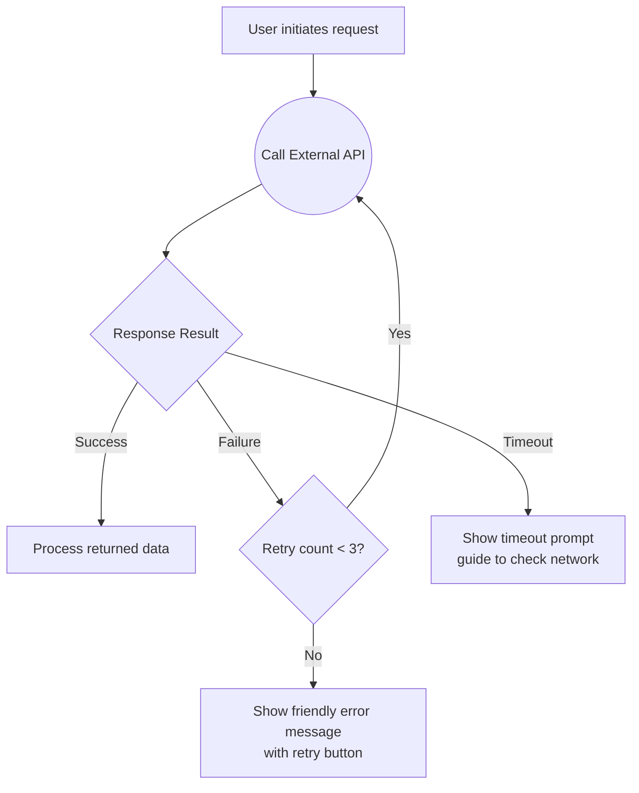
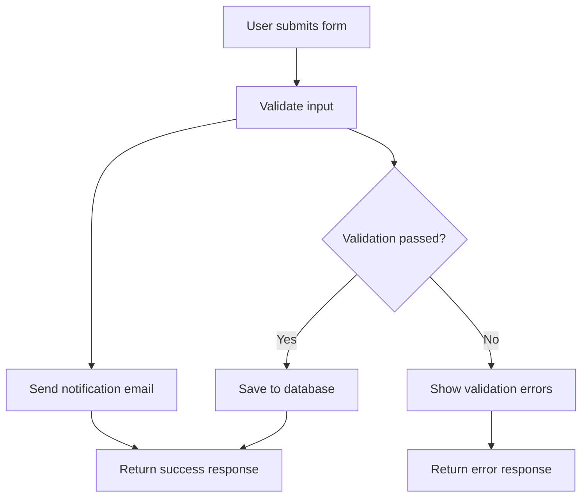
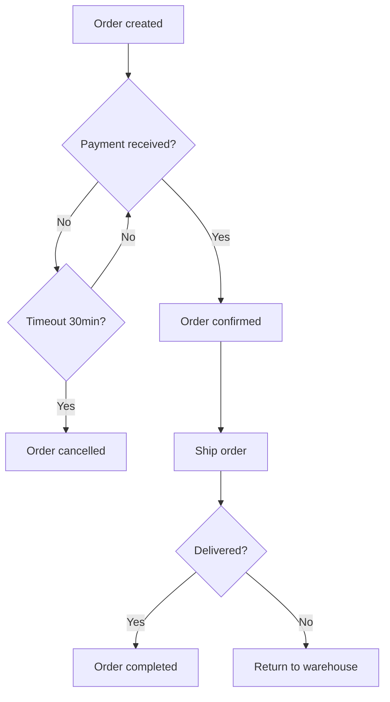
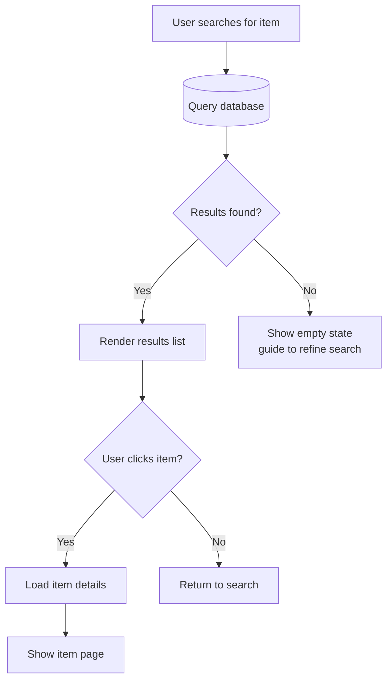

# Mermaid Flowchart Common Snippet Library

## Snippet 1: API Call + Judgment Branch

## Snippet 2: Parallel Processing + Merge

## Snippet 3: State Machine Flow

## Snippet 4: Database Read/Write + Conditional Branch

