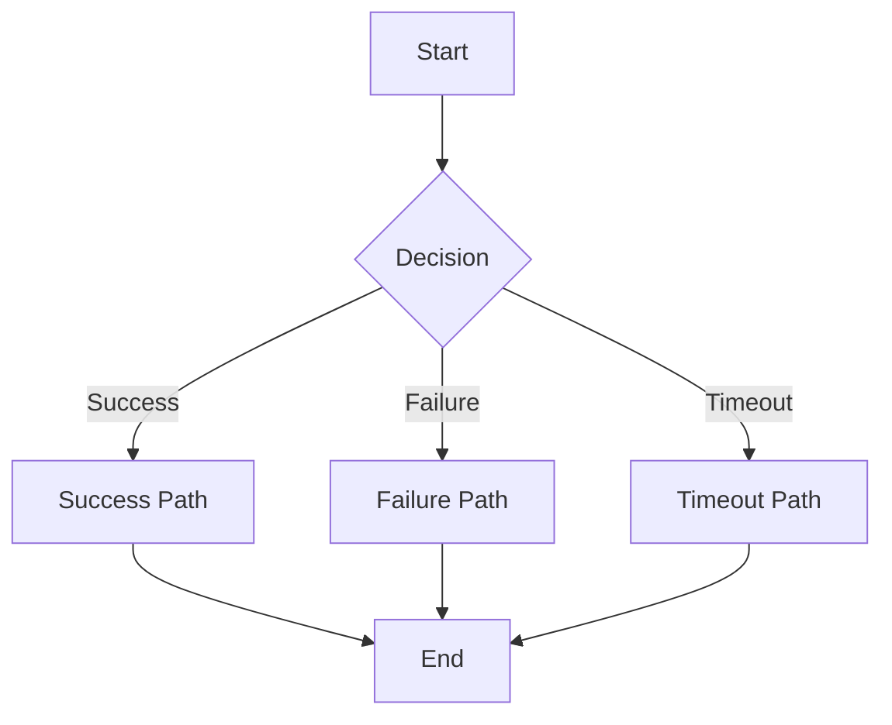
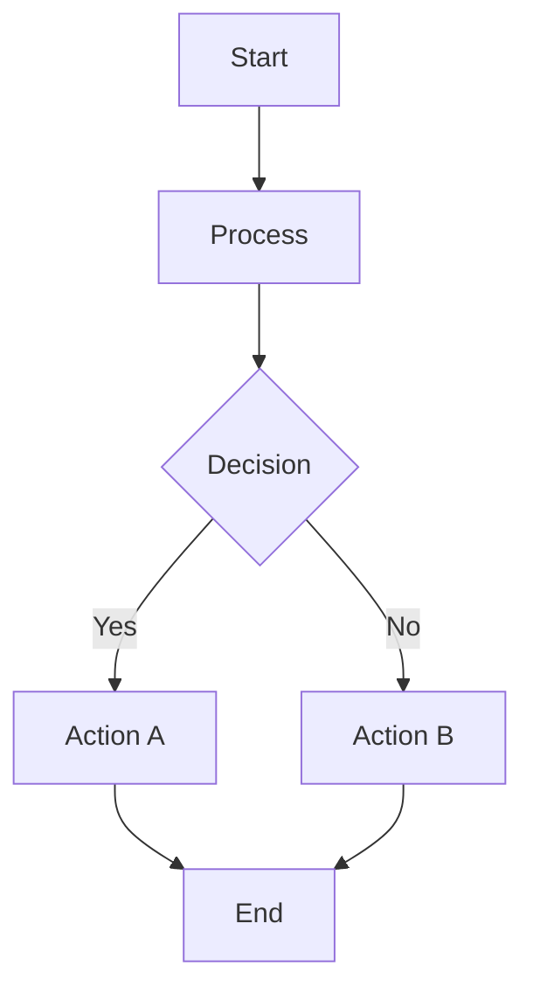

# PRD: {Product Name} - {Feature Name}

## Metadata

| Field        | Value        |
| ------------ | ------------ |
| Author       | {Author}     |
| Status       | Draft        |
| Created      | {YYYY-MM-DD} |
| Last Updated | {YYYY-MM-DD} |
| Version      | v1.0.0       |
| Project      | {Project}    |
| Related Docs | None         |
| Prototype    | None         |

## Changelog

| Date       | Version | Author  | Changes |
| ---------- | ------- | ------- | ------- |
| {YYYY-MM-DD} | v1.0.0  | {Author} | Initial version created |

## Key Update Notes

{Brief summary of design intent and impact scope for this update}

## 1. Problem Description

### Core Problem

{Describe the core problem to be solved}

### Specific Problems

| # | Problem | User Feedback | Severity |
|---|---------|--------------|----------|
| 1 | {Problem description} | "{User quote}" | **P0** |
| 2 | {Problem description} | "{User quote}" | **P1** |

### Impact Scope

- **{User Type 1}**: {Impact description}
- **{User Type 2}**: {Impact description}

## 2. Goal Definition

### Core Goals

1. **{Goal 1}**: {Description}
2. **{Goal 2}**: {Description}

### Success Metrics

| Metric | Current Baseline | Target | Measurement Method |
| ------ | ---------------- | ------ | ------------------ |
| {Metric 1} | {Current value} | {Target value} | {How to measure} |
| {Metric 2} | {Current value} | {Target value} | {How to measure} |

## 3. Target Users

| User Type | Use Case | Priority | Core Need |
| --------- | -------- | -------- | --------- |
| {User Type 1} | {Scenario description} | P0 | {What they need} |
| {User Type 2} | {Scenario description} | P1 | {What they need} |

## 4. User Stories

| ID | User Story | Acceptance Criteria |
|----|-----------|---------------------|
| US-1.1 | As a {user type}, I want {action} so that {benefit} | {Testable criteria} |
| US-1.2 | As a {user type}, I want {action} so that {benefit} | {Testable criteria} |

## 5. Feature Interaction Flowcharts

### 5.1 {Scenario 1 Name}

### 5.2 {Scenario 2 Name}

## 6. Detailed Feature List

| ID | Feature Module | Feature Name | Priority | Description |
|----|---------------|-------------|----------|-------------|
| F-1.1 | {Module} | {Feature} | P0 | {Brief description} |
| F-1.2 | {Module} | {Feature} | P1 | {Brief description} |

**Priority Definition:**
- **P0 (Critical)**: Feature is unusable without it, must deliver in v1
- **P1 (Important)**: User experience significantly impacted, should deliver in v1
- **P2 (Nice-to-have)**: Better to have, but doesn't block core flow

## 7. Feature Details

### F-{x}.{x} {Feature Name}

**Feature Description**: {What this feature does}

**Trigger Condition**: {When this feature is triggered}

**Interaction Description**:
- {Interaction detail 1}
- {Interaction detail 2}
- {Interaction detail 3}

**Acceptance Criteria**:
- [ ] {Testable criterion 1 with quantifiable threshold}
- [ ] {Testable criterion 2 with quantifiable threshold}
- [ ] {Testable criterion 3 with quantifiable threshold}

**Data Table** (if applicable):

| Field | Type | Constraints | Description |
| ----- | ---- | ----------- | ----------- |
| id | INT | PRIMARY KEY, AUTO_INCREMENT | Record ID |
| {field_name} | {type} | {constraints} | {description} |

## 8. Tracking Design

### 8.1 Tracking Platform

Tracking platform: {Platform name, e.g., Sensors Analytics}

### 8.2 Tracking Event List

| Event ID | Event Name | Trigger Condition | Serves Which Success Metric | Key Business Fields |
| -------- | ---------- | ----------------- | --------------------------- | ------------------- |
| BT-1.1 | `{event_name}` | {When triggered} | {Success metric} | {field1, field2, field3} |
| BT-1.2 | `{event_name}` | {When triggered} | {Success metric} | {field1, field2, field3} |

### 8.3 Success Metric Calculation Methods

| Success Metric | Calculation Method | Tracking Events Used |
| -------------- | ------------------ | -------------------- |
| {Metric 1} | {Formula} | BT-1.1 (deduplicated {field}) |
| {Metric 2} | {Formula} | BT-1.2 (deduplicated {field}) |

### 8.4 CSAT Research Plan (Optional)

| Item | Description |
| ---- | ----------- |
| Research Timing | {When to survey} |
| Survey Question | {Question text} |
| Target Score | {Target CSAT score} |

## 9. Future Improvement Plans

| ID | Improvement Item | Reason | Priority | Planned Iteration |
|----|-----------------|--------|----------|-------------------|
| F-{x}.{x} | {Feature name} | {Why not in v1} | P1/P2 | v{x}.{x} |

## 10. Risks & Dependencies

### 10.1 Technical Risks

| Risk ID | Risk Description | Impact Level | Mitigation Measure |
| ------- | ---------------- | ------------ | ------------------ |
| R-1 | {Risk description} | High/Medium/Low | {Mitigation plan} |

### 10.2 External Dependencies

| Dependency ID | Dependency Item | Dependent Party | Impact | Schedule Status |
| ------------- | --------------- | --------------- | ------ | --------------- |
| D-1 | {Dependency description} | {Team/Service} | {Impact if delayed} | {pending-review/pending-confirm/confirmed/completed/blocked} |

### 10.3 Known Limitations

| Limitation ID | Limitation Description | Impact Scope | Resolution Plan |
| ------------- | ---------------------- | ------------ | --------------- |
| L-1 | {Limitation description} | {Who is affected} | {When/how to resolve} |

## 11. Glossary

| Term | Definition | First Appeared Chapter |
| ---- | ---------- | ---------------------- |
| {Term 1} | {Definition} | Chapter {N} |
| {Term 2} | {Definition} | Chapter {N} |

## 12. Assumption Index

| ID | Assumption Description | Source Chapter | Confirmation Status |
|----|----------------------|----------------|---------------------|
| A-1 | {Assumption text} | Chapter {N} | To Confirm |
| A-2 | {Assumption text} | Chapter {N} | To Confirm |
