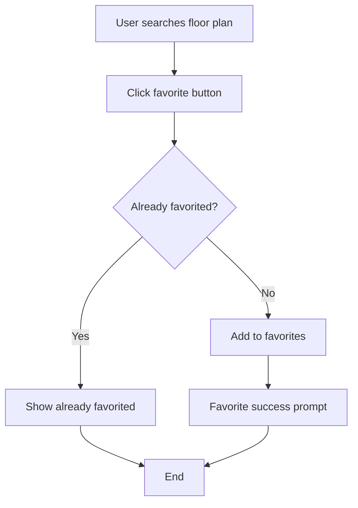
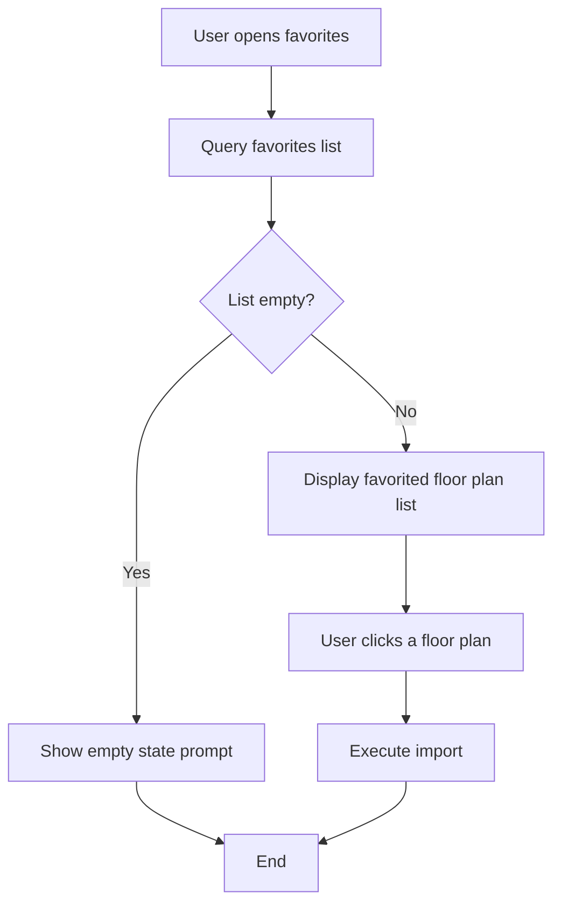

# PRD: Floor Plan Tool - Floor Plan Favorites

## Metadata

| Field        | Value            |
| ------------ | ---------------- |
| Author       | Sam Tan          |
| Status       | Draft            |
| Created      | 2026-05-22       |
| Last Updated | 2026-05-22       |
| Version      | v1.0.0           |
| Project      | Floor Plan Tool [Favorites Feature] |
| Related Docs | None             |
| Prototype    | None             |

## Changelog

| Date       | Version | Author  | Changes |
| ---------- | ------- | ------- | ------- |
| 2026-05-22 | v1.0.0  | Sam Tan | Initial version created |

## 1. Problem Description

### Core Problem

Currently the floor plan tool requires re-selecting province, city, and community name for each floor plan search. Brokers' frequently-used floor plans cannot be quickly reused, averaging 1-2 minutes per search.

### Specific Problems

| # | Problem | User Feedback | Severity |
|---|---------|--------------|----------|
| 1 | High-frequency floor plans cannot be quickly reused, re-searched each time | "I have to search for the same communities every day" | **P0** |
| 2 | Long search operation chain (province→city→community→select) | "Takes forever to select, wastes time" | **P0** |
| 3 | Different brokers cannot share frequently-used floor plans | "I can't find the good floor plans my colleagues use" | **P1** |

### Impact Scope

- **Brokers**: High-frequency usage scenario, search 10-20 floor plans daily, repetitive operations waste time
- **Outsourced editors**: Need to search floor plans in different regions, frequently-used floor plans cannot be quickly located

## 2. Goal Definition

### Core Goals

1. **Favorites feature**: Brokers can favorite frequently-used floor plans, one-click call next time
2. **Reduce operation steps**: Calling floor plan from favorites from 4 steps to 1 step

### Success Metrics

| Metric | Current Baseline | Target | Measurement Method |
| ------ | ---------------- | ------ | ------------------ |
| Average search operation steps | 4 steps | ≤1 step (call from favorites) | Tracking statistics |
| Favorites usage rate | N/A | >60% of active users use | Tracking statistics |
| Favorite floor plan reuse rate | N/A | >70% of favorited floor plans are reused | Tracking statistics |

## 3. Target Users

| User Type | Use Case | Priority | Core Need |
| --------- | -------- | -------- | --------- |
| Broker | Searches same community floor plans daily, wants one-click call | P0 | Quick reuse, one-click favorite |
| Outsourced editor | Needs to search floor plans in different regions | P1 | Categorized management, quick find |

## 4. User Stories

| ID | User Story | Acceptance Criteria |
|----|-----------|---------------------|
| US-1.1 | As a broker, I want to click favorite after searching for a floor plan so that I can one-click call it from favorites next time | Favorite button visible, click favorites successfully |
| US-1.2 | As a broker, I want to see my favorited floor plan list in favorites so that I can click to import | List displays normally, click imports successfully |
| US-1.3 | As a broker, I want to unfavorite floor plans I no longer need | Unfavorite function works normally |

## 5. Feature Interaction Flowcharts

### 5.1 Favorite Flow

### 5.2 Favorites Call Flow

## 6. Detailed Feature List

| ID | Feature Module | Feature Name | Priority | Description |
|----|---------------|-------------|----------|-------------|
| F-1.1 | Frontend Interaction | Favorite Button | P0 | Show favorite button on search results page |
| F-1.2 | Frontend Interaction | Favorites List Page | P0 | Display favorited floor plan list |
| F-1.3 | Frontend Interaction | Unfavorite | P1 | Remove floor plan from favorites |
| F-1.4 | Backend Service | Favorite Data Storage | P0 | Store user-favorite relationship |

## 7. Feature Details

### F-1.1 Favorite Button

**Feature Description**: Show favorite button next to each floor plan card on search results page.

**Trigger Condition**: After user searches for floor plan results.

**Interaction Description**:
- Star-shaped favorite button on right side of each floor plan card
- Unfavorited state: hollow star, hover shows "Favorite" tooltip
- Favorited state: solid star (gold), hover shows "Favorited" tooltip
- Click favorite: call backend API,成功后 becomes solid star, shows "Favorited" prompt bar
- Click favorited: unfavorite, call backend API,成功后 becomes hollow star

**Acceptance Criteria**:
- [ ] Favorite button visible next to each floor plan card on search results page
- [ ] Unfavorited/favorited states visually distinct
- [ ] State switch completes within 1 second after clicking favorite
- [ ] Favorite success prompt bar shows for 2 seconds then auto-dismisses

### F-1.2 Favorites List Page

**Feature Description**: Display user's favorited floor plan list.

**Trigger Condition**: User clicks "Favorites" tab in sidebar.

**Interaction Description**:
- Sorted by favorite time descending
- Each item shows: floor plan thumbnail, community name, floor plan name, favorite time
- Empty state: shows "No favorites yet, search floor plans and click star to favorite"
- Click item: execute import operation

**Acceptance Criteria**:
- [ ] Favorites list sorted by favorite time descending
- [ ] Each item has complete info (thumbnail/community name/floor plan name/time)
- [ ] Empty state prompt is friendly
- [ ] Click item imports successfully

### F-1.3 Unfavorite

**Feature Description**: Remove favorited floor plan from favorites.

**Trigger Condition**: User clicks unfavorite button in favorites.

**Interaction Description**:
- "Unfavorite" button (trash icon) on right side of each favorite item
- Click shows confirmation dialog: "Confirm unfavorite this floor plan?"
- After confirmation, call backend API, remove from list on success

**Acceptance Criteria**:
- [ ] Unfavorite button visible
- [ ] Confirmation dialog displays normally
- [ ] Removes from list after confirmation
- [ ] Corresponding floor plan on search results page changes to unfavorited state

### F-1.4 Favorite Data Storage

**Feature Description**: Backend stores user-floor plan favorite relationship.

**Trigger Condition**: When user clicks favorite/unfavorite.

**Interaction Description**:
- New user_favorite_floorplan table
- Fields: id, user_id, floorplan_id, community_name, created_at
- Composite unique index: (user_id, floorplan_id)
- Query API: GET /api/floorplan/favorites?user_id={user_id}

**Acceptance Criteria**:
- [ ] user_favorite_floorplan table created successfully
- [ ] Composite unique index生效
- [ ] Favorite/unfavorite API response time P95 <500ms
- [ ] Query API returns correctly sorted favorites list

## 8. Tracking Design

### 8.1 Tracking Platform

Tracking platform: Sensors Analytics

### 8.2 Tracking Event List

| Event ID | Event Name | Trigger Condition | Serves Which Success Metric | Key Business Fields |
| -------- | ---------- | ----------------- | --------------------------- | ------------------- |
| BT-1.1 | `favorite_add` | When user clicks favorite button successfully | Favorites usage rate | user_id, floorplan_id, community_name |
| BT-1.2 | `favorite_remove` | When user unfavorites successfully | Favorites usage rate | user_id, floorplan_id |
| BT-1.3 | `favorite_list_open` | When user opens Favorites tab | Favorites usage rate | user_id, favorite_count (current favorites) |
| BT-1.4 | `favorite_import` | When user clicks import from favorites | Favorite floor plan reuse rate | user_id, floorplan_id, days_since_favorite |

### 8.3 Success Metric Calculation Methods

| Success Metric | Calculation Method | Tracking Events Used |
| -------------- | ------------------ | -------------------- |
| Favorites usage rate | Unique users who used favorites / total active users | BT-1.3 (deduplicated user_id) |
| Favorite floor plan reuse rate | Favorited floor plans that were imported / total favorited floor plans | BT-1.4 (deduplicated floorplan_id) |

## 9. Future Improvement Plans

| ID | Improvement Item | Reason | Priority | Planned Iteration |
|----|-----------------|--------|----------|-------------------|
| F-1.5 | Favorites categorized management | Hard to find when many favorites | P1 | v1.1 |
| F-1.6 | Favorites search | Quickly locate favorited floor plans | P1 | v1.1 |
| F-1.7 | Favorites sharing | Share frequently-used floor plans among team members | P1 | v1.2 |

## 10. Risks & Dependencies

### 10.1 Technical Risks

| Risk ID | Risk Description | Impact Level | Mitigation Measure |
| ------- | ---------------- | ------------ | ------------------ |
| R-1 | Query slows down as favorite data grows | Medium | Add pagination, 20 items per page, index optimization |
| R-2 | User accidentally unfavorites | Low | Confirmation dialog + operation log recoverable |

### 10.2 External Dependencies

| Dependency ID | Dependency Item | Dependent Party | Impact | Schedule Status |
| ------------- | --------------- | --------------- | ------ | --------------- |
| D-1 | Sensors Analytics tracking integration | Data Team | Tracking needs data team configuration | confirmed |
| D-2 | Database table structure change | DBA/Backend | New user_favorite_floorplan table | pending-review |

### 10.3 Known Limitations

| Limitation ID | Limitation Description | Impact Scope | Resolution Plan |
| ------------- | ---------------------- | ------------ | --------------- |
| L-1 | Favorites categorization not supported this release | Users with many favorites | Listed as F-1.5, added in v1.1 |
