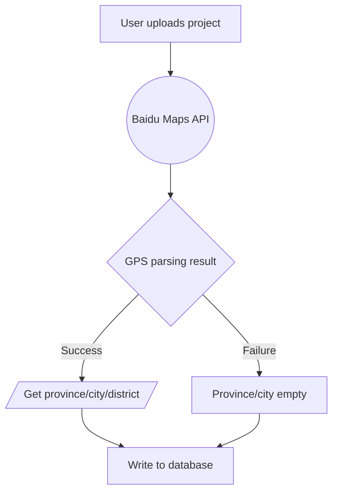
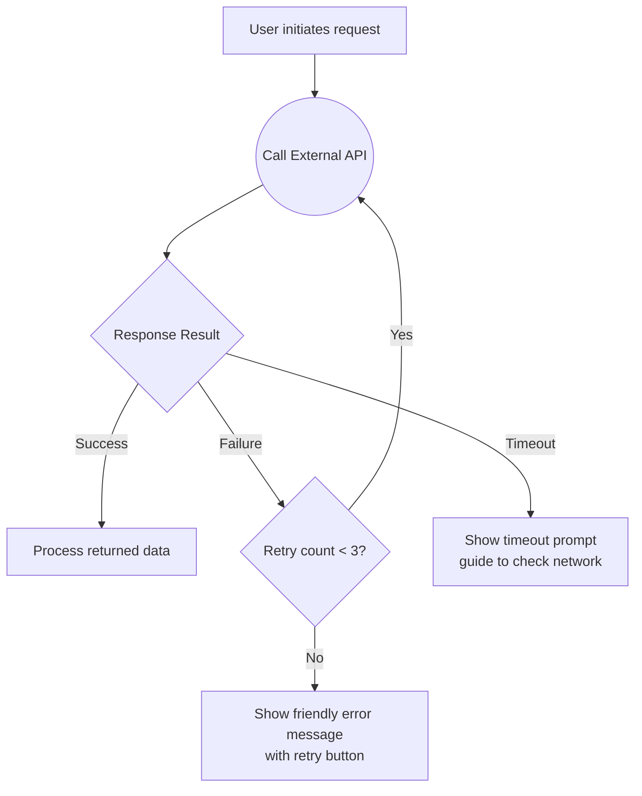
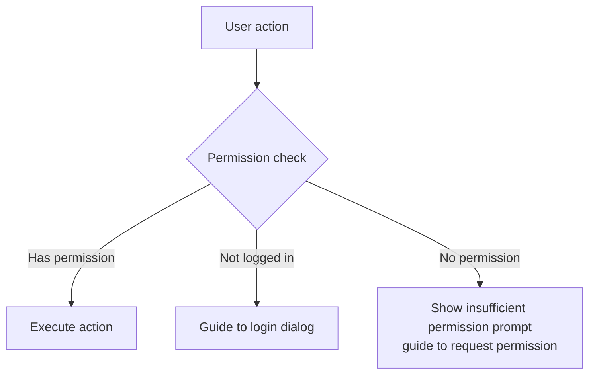
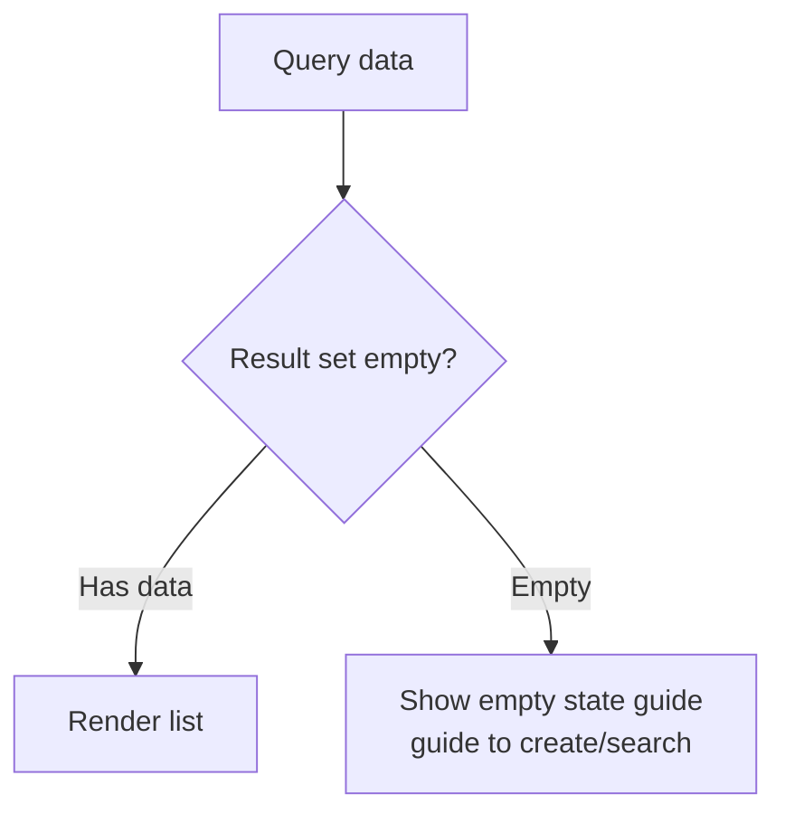
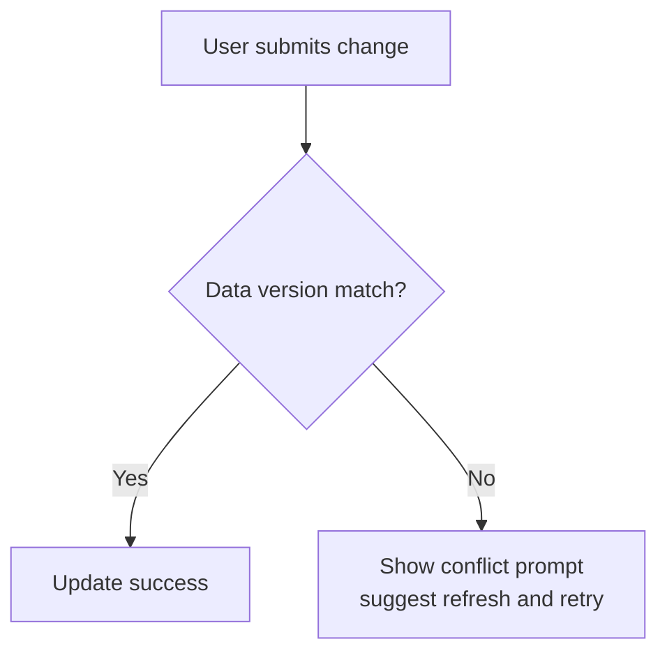
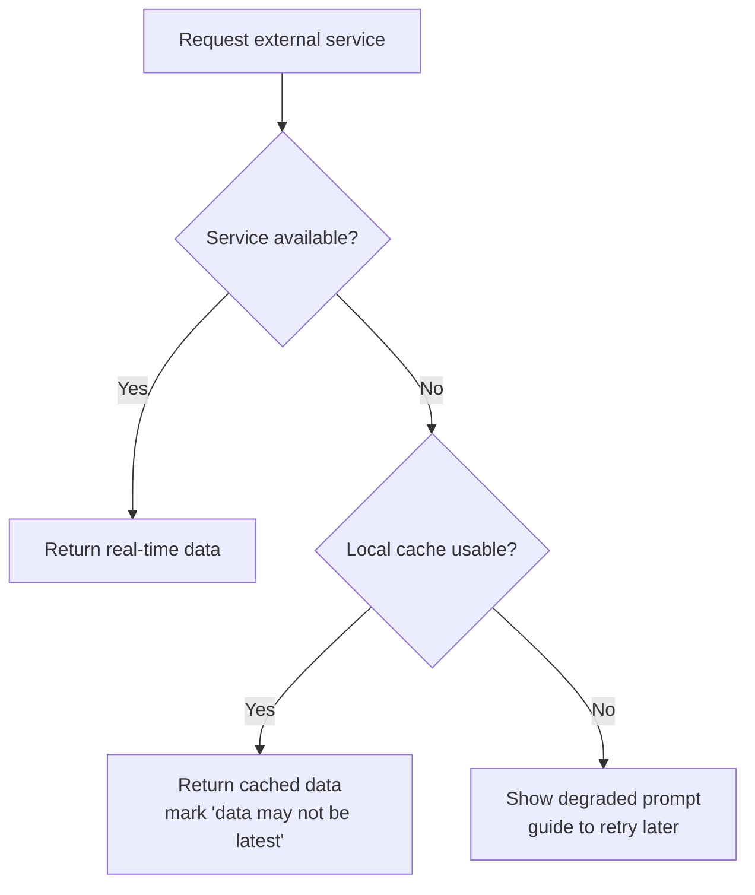

# Flowchart Generation Rules

## Mandatory Requirements

- Each PRD **at least 1** mermaid flowchart
- Each core business scenario **independent chart**
- Use `flowchart TD` (top-down direction) uniformly

## Granularity

| Rule | Description |
| ---- | ----------- |
| Nodes per chart | **8-20 nodes** |
| Over 20 nodes | Must split into sub-flowcharts |
| Under 5 nodes | May be too simple, suggest merging or adding detail |
| Split basis | By "business scenario/data flow", not by feature module |

**Why 8-20**: Under 8 nodes can usually be merged into main flow; over 20 nodes readability drops sharply, hard to review.

## Node Shape Semantics

| Shape | Mermaid Syntax | Usage |
| ----- | -------------- | ----- |
| Rectangle | `[text]` | Start/end/normal processing step |
| Diamond | `{text}` | Judgment node (success/failure/timeout branches) |
| Circle | `((text))` | External API call |
| Parallelogram | `[/text/]` | Data input/output |

**Example**:


## Judgment Node Rules

Each judgment node must have clear branches:

| Branch Type | When Required | Example |
| ----------- | ------------- | ------- |
| Success | Always | `-->|Success|` |
| Failure | When applicable (API calls, data queries) | `-->|Failure|` |
| Timeout | When applicable (external calls with timeout) | `-->|Timeout|` |

**Why**: PRD flowcharts must cover exception paths, otherwise developers don't know how to handle failures.

## Multi-line Node Text

Use `<br/>` to separate title and description:

```
[GPS Reverse Geocoding<br/>Baidu Maps API]
[LLM Property Name Parsing<br/>Qwen API]
[Query project_location_parse Table<br/>Cache miss]
```

**Why**: Single-line text lacks information, two-line format explains both "what" and "with what".

## State Value Alignment Rules

State values/enums in flowcharts must match Chapter 7 data table field definitions:

| Check Item | Method |
| ---------- | ------ |
| parse_status enum values | success/partial/failed/pending in flowchart must match data table ENUM |
| gps_status enum values | success/failed/timeout in flowchart must match data table ENUM |
| Field name references | Field names referenced in flowcharts (project_id, community_name) must match data table |

**Validation method**: After generating flowchart, grep Chapter 7 data table ENUM definitions, cross-compare with flowchart labels.

## Edge Label Format

Use `-->|condition|` format for branch judgments:
```
C -->|Success| D[Success handling]
C -->|Failure| E[Failure handling]
C -->|Timeout| E
```

Normal flow without labels:
```
A --> B
B --> C
```

## Generation Timing

| Intent | Behavior |
| ------ | -------- |
| create | Generate all flowcharts at once, confirm each with user |
| update | If feature chain changes, proactively ask if corresponding flowchart needs updating |
| validate | Check if existing flowcharts comply with rules |

## Common Exception Pattern Templates

Reference common web application exception paths, apply directly when generating flowcharts:

### 1. Network Error → Retry → Failure-Friendly Prompt



### 2. Insufficient Permissions → Block → Guide



### 3. Data Not Found → Empty State Guide



### 4. Concurrency Conflict → Optimistic Lock → Conflict Prompt



### 5. External Dependency Unavailable → Degrade → Cache Fallback



## Common Errors

| Error | Correct Approach |
| ----- | ---------------- |
| Using `graph TD` | Use `flowchart TD` (new syntax) |
| Judgment nodes only have success branch | Add failure/timeout branches |
| Node text too long | Use `<br/>` for line breaks, or split nodes |
| State values don't match data table | Cross-validate after generation |
| Single chart over 20 nodes | Split into sub-flowcharts |
| API calls without failure handling | Must add failure+timeout branches |
