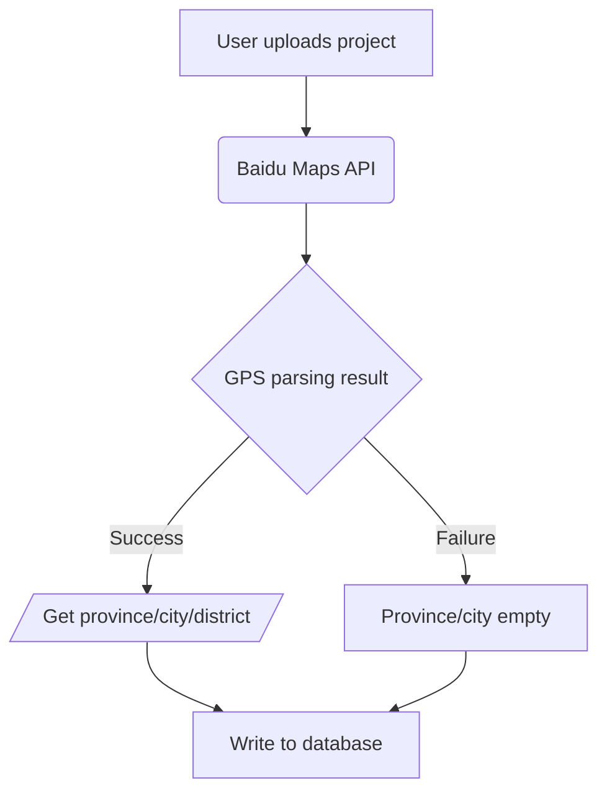
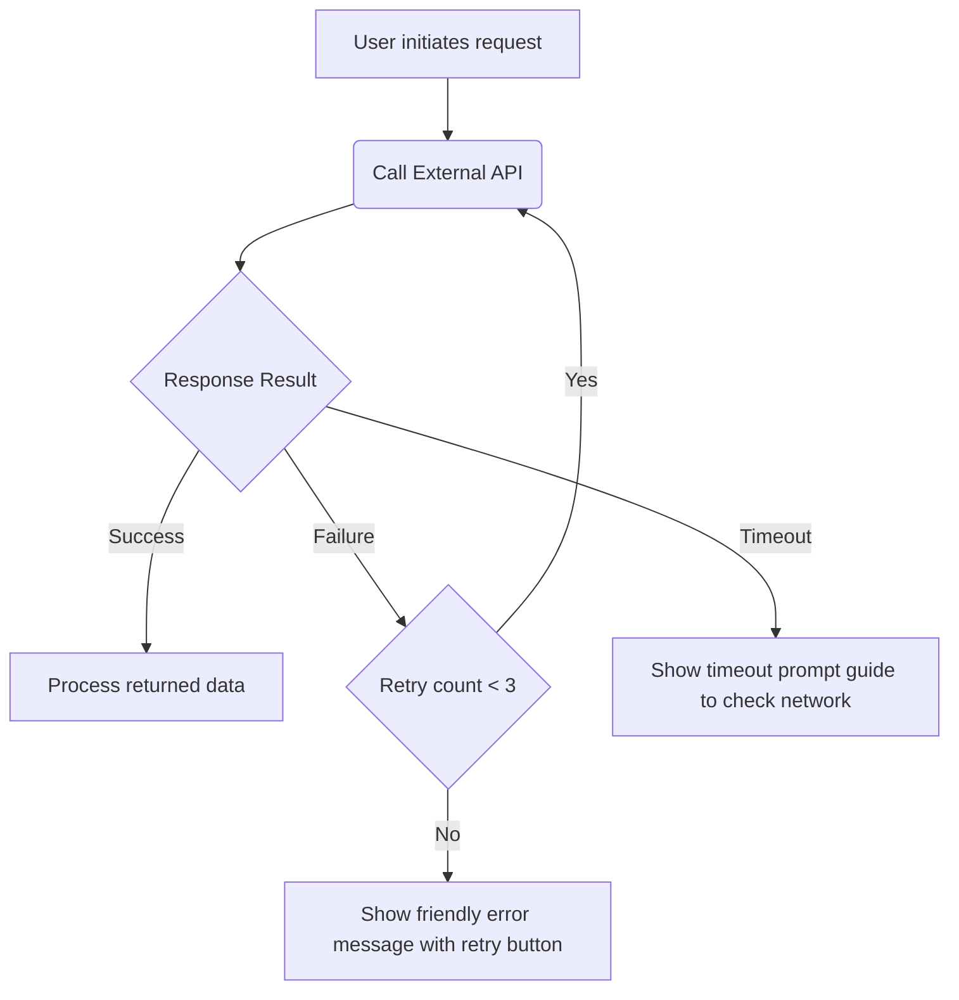
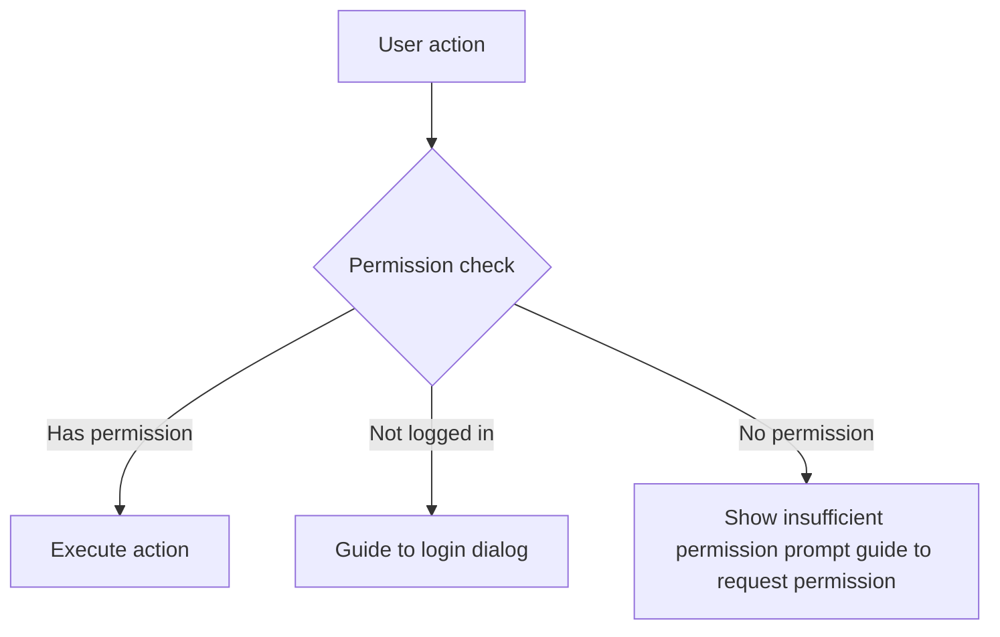
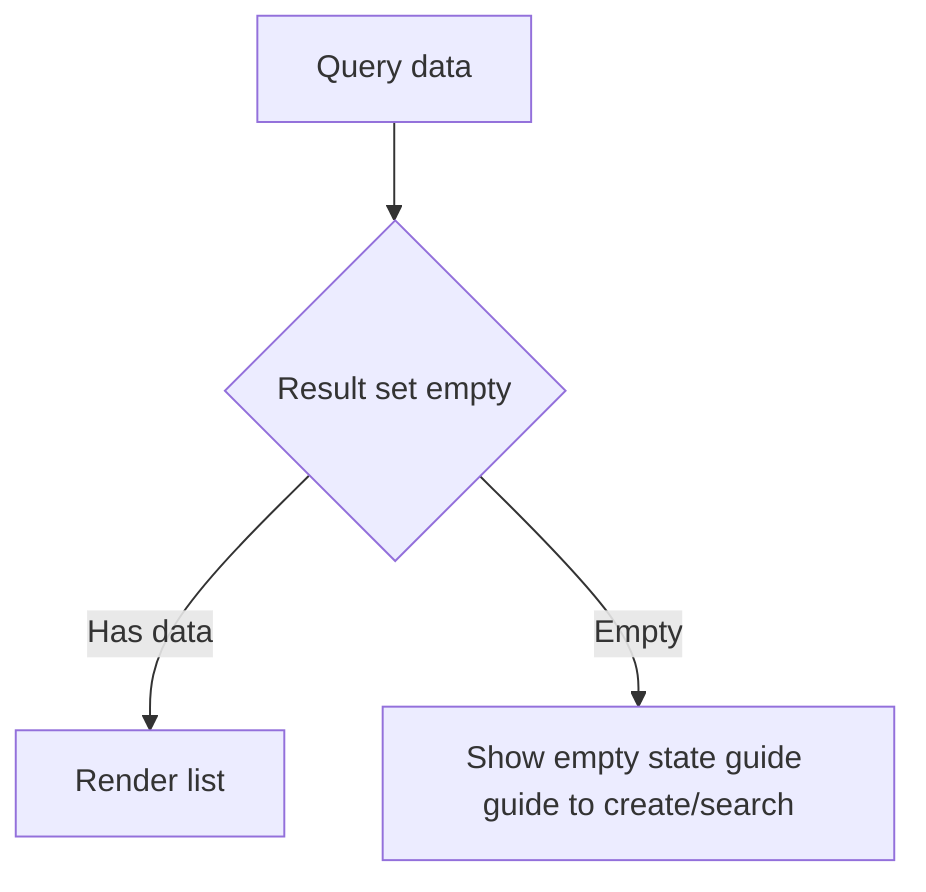
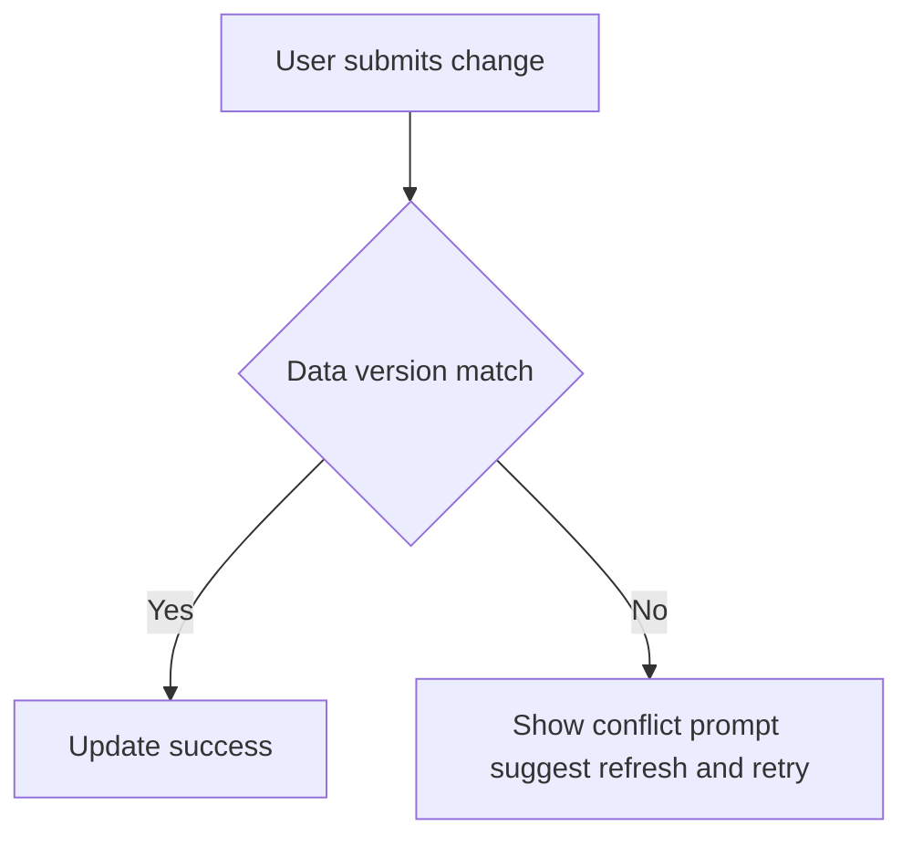
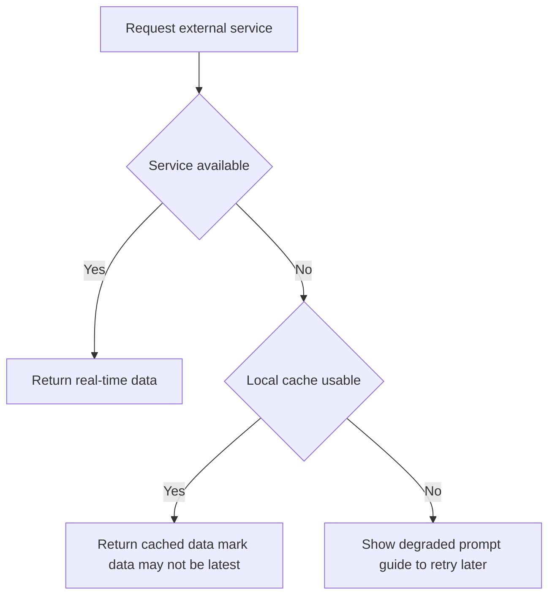

# Flowchart Generation Rules

## Mandatory Requirements

- Each PRD **at least 1** mermaid flowchart
- Each core business scenario **independent chart**
- Use `flowchart TD` (top-down direction) uniformly

## Cross-Engine Compatibility Rules (MANDATORY)

All mermaid code blocks MUST comply with these rules to ensure correct rendering
across all editor engines (Zed, VS Code, GitHub, Obsidian, etc.):

1. **No ASCII double quotes** — `"` characters have special semantics in some
   mermaid.js versions and may cause parse failures when combined with HTML tags
   or non-ASCII characters. Use single quotes `'` or no quotes for all labels.
2. **No circle nodes** — `((text))` is not universally supported. Replace with
   `(text)` (rounded rectangle) for all external API/service calls.
3. **No HTML tags in node text** — `<br/>`, `<strong>`, etc. may fail to parse.
   Split long node text into separate nodes instead.

## Granularity

| Rule | Description |
| ---- | ----------- |
| Nodes per chart | **8-20 nodes** |
| Over 20 nodes | Must split into sub-flowcharts |
| Under 5 nodes | May be too simple, suggest merging or adding detail |
| Split basis | By "business scenario/data flow", not by feature module |

**Why 8-20**: Under 8 nodes can usually be merged into main flow; over 20 nodes readability drops sharply, hard to review.

## Node Shape Semantics

| Shape | Mermaid Syntax | Usage |
| ----- | -------------- | ----- |
| Rectangle | `[text]` | Start/end/normal processing step |
| Rounded Rect | `(text)` | External API call (was circle, now compatible) |
| Diamond | `{text}` | Judgment node (success/failure/timeout branches) |
| Parallelogram | `[/text/]` | Data input/output |

**Example**:

```mermaid
flowchart TD
    A[User uploads project] --> B(Baidu Maps API)
    B --> C{GPS parsing result}
    C -->|Success| D[/Get province/city/district/]
    C -->|Failure| E[Province/city empty]
    D --> F[Write to database]
    E --> F
```

## Judgment Node Rules

Each judgment node must have clear branches:

| Branch Type | When Required | Example |
| ----------- | ------------- | ------- |
| Success | Always | `-->|Success|` |
| Failure | When applicable (API calls, data queries) | `-->|Failure|` |
| Timeout | When applicable (external calls with timeout) | `-->|Timeout|` |

**Why**: PRD flowcharts must cover exception paths, otherwise developers don't know how to handle failures.

## State Value Alignment Rules

State values/enums in flowcharts must match Chapter 7 data table field definitions:

| Check Item | Method |
| ---------- | ------ |
| parse_status enum values | success/partial/failed/pending in flowchart must match data table ENUM |
| gps_status enum values | success/failed/timeout in flowchart must match data table ENUM |
| Field name references | Field names referenced in flowcharts (project_id, community_name) must match data table |

**Validation method**: After generating flowchart, grep Chapter 7 data table ENUM definitions, cross-compare with flowchart labels.

## Edge Label Format

Use `-->|condition|` format for branch judgments:
```
C -->|Success| D[Success handling]
C -->|Failure| E[Failure handling]
C -->|Timeout| E
```

Normal flow without labels:
```
A --> B
B --> C
```

## Generation Timing

| Intent | Behavior |
| ------ | -------- |
| create | Generate all flowcharts at once, confirm each with user |
| update | If feature chain changes, proactively ask if corresponding flowchart needs updating |
| validate | Check if existing flowcharts comply with rules |

## Common Exception Pattern Templates

Reference common web application exception paths, apply directly when generating flowcharts:

### 1. Network Error → Retry → Failure-Friendly Prompt


```mermaid
flowchart TD
    A[User initiates request] --> B(Call External API)
    B --> C{Response Result}
    C -->|Success| D[Process returned data]
    C -->|Failure| E{Retry count < 3}
    E -->|Yes| B
    E -->|No| F[Show friendly error message with retry button]
    C -->|Timeout| G[Show timeout prompt guide to check network]
```

### 2. Insufficient Permissions → Block → Guide


```mermaid
flowchart TD
    A[User action] --> B{Permission check}
    B -->|Has permission| C[Execute action]
    B -->|Not logged in| D[Guide to login dialog]
    B -->|No permission| E[Show insufficient permission prompt guide to request permission]
```

### 3. Data Not Found → Empty State Guide


```mermaid
flowchart TD
    A[Query data] --> B{Result set empty}
    B -->|Has data| C[Render list]
    B -->|Empty| D[Show empty state guide guide to create/search]
```

### 4. Concurrency Conflict → Optimistic Lock → Conflict Prompt


```mermaid
flowchart TD
    A[User submits change] --> B{Data version match}
    B -->|Yes| C[Update success]
    B -->|No| D[Show conflict prompt suggest refresh and retry]
```

### 5. External Dependency Unavailable → Degrade → Cache Fallback


```mermaid
flowchart TD
    A[Request external service] --> B{Service available}
    B -->|Yes| C[Return real-time data]
    B -->|No| D{Local cache usable}
    D -->|Yes| E[Return cached data mark data may not be latest]
    D -->|No| F[Show degraded prompt guide to retry later]
```

## Common Errors

| Error | Correct Approach |
| ----- | ---------------- |
| Using `graph TD` | Use `flowchart TD` (new syntax) |
| Judgment nodes only have success branch | Add failure/timeout branches |
| Node text too long | Split into multiple nodes instead of line breaks |
| State values don't match data table | Cross-validate after generation |
| Single chart over 20 nodes | Split into sub-flowcharts |
| API calls without failure handling | Must add failure+timeout branches |
| Using `((circle))` nodes | Use `(rounded rect)` instead |
| Using double quotes in labels | Use single quotes `'text'` or no quotes |
| Using `<br/>` in node text | Split into separate nodes |
