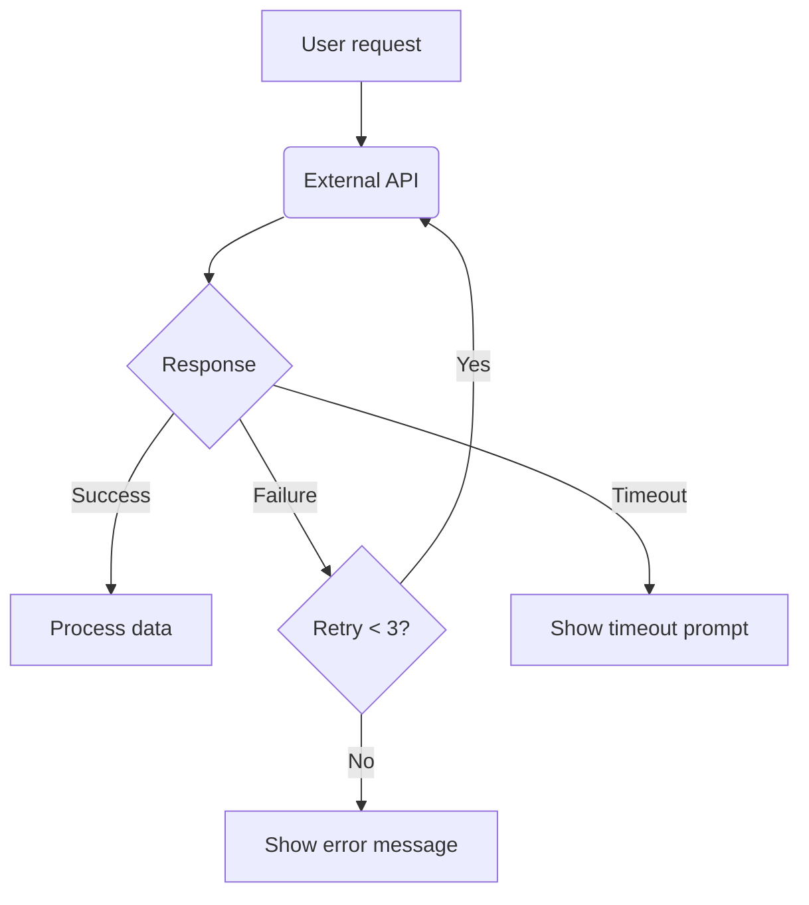

# PRD Detailed Guide

## Chapter Structure

| # | Chapter | Content |
|---|---------|---------|
| 1 | Problem Description | Core problem + specific problems table + impact scope |
| 2 | Goal Definition | Core goals + success metrics table (with baseline/target) |
| 3 | Target Users | User type table with use cases, priorities, core needs |
| 4 | User Stories | US-x.x IDs, "As a {user}, I want {action} so that {benefit}" |
| 5 | Feature Flowcharts | Mermaid `flowchart TD` — **MUST have `|Failure|` and `|Timeout|` branches** |
| 6 | Feature List | F-x.x IDs, module, name, Target Platform, P0/P1/P2 priority |
| 7 | Feature Details | `### F-x.x` for each feature: description, trigger, interaction, `- [ ]` acceptance criteria |
| 8 | Tracking Design | BT-x.x events table + Success Metric Calculation Methods table |
| 9 | Future Improvements | F-x.x numbering continues from Chapter 7 |
| 10 | Risks & Dependencies | Technical risks + external dependencies with schedule status (pending-review/pending-confirm/confirmed/completed/blocked) |
| 11 | Decision Log | Auto-generated decisions with rationale |
| 12 | Glossary + Assumption Index | Domain terms + all [ASSUMPTION] tags summarized |
| 13 | Assumption Index | A-x.x assumptions with confirmation status |

## Mermaid Flowchart Example



## Strict Validation Checklist

Before saving, verify:
- [ ] Metadata table complete (8 fields including Version v1.0.0)
- [ ] US↔F-x.x bidirectional traceability (each US has F-x.x, each F-x.x has US)
- [ ] Chapter 6 F-x.x numbering == Chapter 7 ### F-x.x sections (1:1 match)
- [ ] Acceptance criteria in `- [ ]` format with testable conditions
- [ ] At least 1 mermaid flowchart with `flowchart TD` syntax
- [ ] Every API/dependency node has `|Failure|` and `|Timeout|` branches
- [ ] Tracking events (BT-x.x) map 1:1 to success metrics
- [ ] Success metrics have calculation methods referencing BT-x.x events
- [ ] External dependencies have schedule status (pending-review/pending-confirm/confirmed/completed/blocked)
- [ ] [ASSUMPTION] tags summarized in Assumption Index
- [ ] Feature priorities use P0/P1/P2 (not Must/Should/Could/Won't)
- [ ] No front matter (`---`) in final PRD — only `## Metadata` section

## Requirements Review Template (append at end of PRD)

```markdown
## Review Record

### First Principles Validation
- Who is the user: ✅/❓
- What do they want: ✅/❓
- Why now: ✅/❓
- Why your solution: ✅/❓
- How do you know you got it right: ✅/❓

### Logical Completeness
- US→FR traceability pass rate: X/Y
- FR→US traceability pass rate: X/Y

### Boundary & Risk
- Exception flows: (list)
- Boundary conditions: (list)
```

## Update Mode: Detailed Rules
- If no existing PRD file found, generate the complete updated PRD from scratch (do NOT search for files)
- Version bump: v1.0.0 → v1.1.0 (features) or v2.0.0 (major changes)
- Include `## Changelog` table (`| Date | Version | Author | Changes |`)
- Include "Key Update Notes" section
- Include change impact / traceability analysis
- Include `## Review Record` with First Principles Validation
- Continue feature numbering from existing max F-x.x

## Progress Tracking (Batch Writes)
Include in output file (docs/spec/{filename}.md): "Batch 1/5", "Batch 2/5"..."Batch 5/5" with ✅ markers.
Example: `✅ Batch 1/5: Chapters 1-3 — Saved` | `⏳ Generating Batch 2/5...`
End with quality score: `Score: XX/100`
