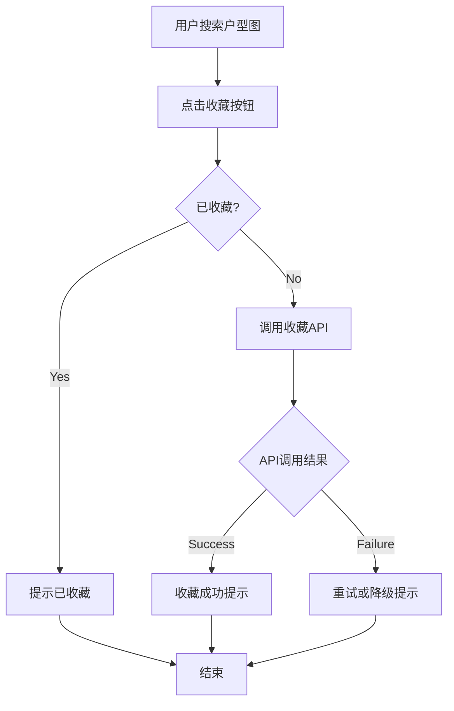
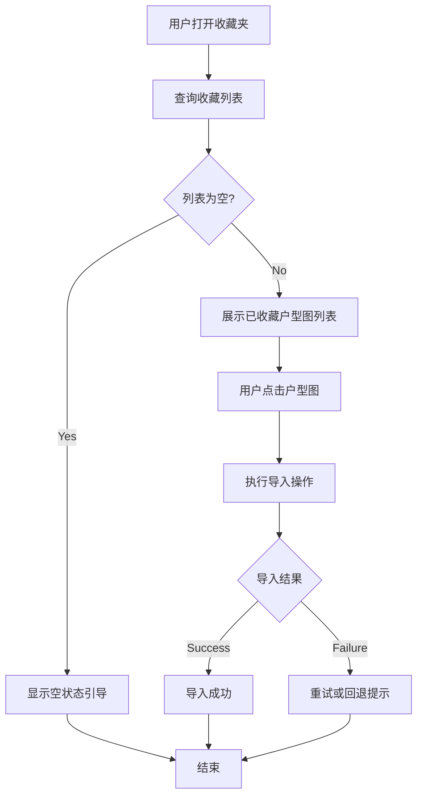

# PRD: 户型图工具 - 户型图收藏功能

## Metadata

| Field        | Value            |
| ------------ | ---------------- |
| Author       | Sam Tan          |
| Status       | Draft            |
| Created      | 2026-06-10       |
| Last Updated | 2026-06-10       |
| Version      | v1.0.0           |
| Project      | 户型图工具 [收藏功能] |
| Related Docs | None             |
| Prototype    | None             |

## 变更记录

| Date | Version | Author | Changes |
| ---------- | ------- | ------- | ------- |
| 2026-06-10 | v1.0.0  | Sam Tan | 初始版本创建 |

## 关键更新说明

本版本新增户型图收藏功能，允许经纪人收藏高频使用的户型图，实现一键调用，减少重复搜索操作。

## 1. 问题描述

### 核心问题

当前户型图工具每次搜索户型图都需要重新选择省、市、小区名称，经纪人高频使用的户型图无法快速复用，平均每次搜索耗时1-2分钟。

### 具体问题

| # | Problem | User Feedback | Severity |
|---|---------|--------------|----------|
| 1 | 高频户型图无法快速复用，每次需重新搜索 | "每天都要搜同一个小区" | **P0** |
| 2 | 搜索操作链过长（省→市→小区→选择） | "选半天，太浪费时间" | **P0** |
| 3 | 不同经纪人之间无法共享常用户型图 | "同事好用的户型图我找不到" | **P1** |

### 影响范围

- **经纪人**：高频使用场景，每天搜索10-20次户型图，重复操作浪费时间
- **外包编辑**：需要在不同区域搜索户型图，高频户型图无法快速定位

## 2. 目标定义

### 核心目标

1. **收藏功能**：经纪人可收藏高频使用的户型图，下次一键调用
2. **减少操作步骤**：从收藏夹调用户型图从4步降至1步

### 成功指标

| Metric | Current Baseline | Target | Measurement Method |
| ------ | ---------------- | ------ | ------------------ |
| 平均搜索操作步骤 | 4步 | ≤1步（从收藏夹调用） | 埋点统计 |
| 收藏夹使用率 | N/A | >60% 活跃用户使用 | 埋点统计 |
| 收藏户型图复用率 | N/A | >70% 被收藏的户型图被复用 | 埋点统计 |

## 3. 目标用户

| User Type | Use Case | Priority | Core Need |
| --------- | -------- | -------- | --------- |
| 经纪人 | 每天搜索相同小区户型图，希望一键调用 | P0 | 快速复用，一键收藏 |
| 外包编辑 | 需要在不同区域搜索户型图 | P1 | 分类管理，快速查找 |

## 4. 用户故事

| ID | User Story | Acceptance Criteria |
|----|-----------|---------------------|
| US-1.1 | 作为经纪人，我希望搜索户型图后能点击收藏，以便下次从收藏夹一键调用，不用重复搜索 | 收藏按钮可见，点击收藏成功 |
| US-1.2 | 作为经纪人，我希望在收藏夹看到已收藏的户型图列表，以便点击导入使用 | 列表正常展示，点击导入成功 |
| US-1.3 | 作为经纪人，我希望取消收藏不再需要的户型图 | 取消收藏功能正常运作 |

## 5. 功能交互流程图

### 5.1 收藏流程

### 5.2 收藏夹调用流程

## 6. 详细功能清单

| ID | Feature Module | Feature Name | Target Platform | Priority | Description |
|----|---------------|-------------|-----------------|----------|-------------|
| F-1.1 | 前端交互 | 收藏按钮 | iOS / Android / Web | P0 | 搜索结果页展示收藏按钮 |
| F-1.2 | 前端交互 | 收藏夹列表页 | iOS / Android / Web | P0 | 展示已收藏的户型图列表 |
| F-1.3 | 前端交互 | 取消收藏 | iOS / Android / Web | P1 | 从收藏夹移除户型图 |
| F-1.4 | 后端服务 | 收藏数据存储 | Backend | P0 | 存储用户-户型图收藏关系 |

## 7. 各详细功能说明

### F-1.1 收藏按钮

**Feature Description**: 在搜索结果页每个户型图卡片旁展示收藏按钮。

**Trigger Condition**: 用户搜索户型图结果后。

**Interaction Description**:
- 星形收藏按钮位于每个户型图卡片右侧
- 未收藏状态：空心星，hover显示"收藏"提示
- 已收藏状态：实心星（金色），hover显示"已收藏"提示
- 点击收藏：调用后端API，成功后变为实心星，显示"已收藏"提示条
- 点击已收藏：取消收藏，调用后端API，成功后变为空心星

**Acceptance Criteria**:
- [ ] 搜索结果页每个户型图卡片旁收藏按钮可见
- [ ] 未收藏/已收藏状态视觉区分明显
- [ ] 点击收藏后状态切换在1秒内完成
- [ ] 收藏成功提示条显示2秒后自动消失

**Data Table**:

| Field | Type | Constraints | Description |
| ----- | ---- | ----------- | ----------- |
| id | INT | PRIMARY KEY, AUTO_INCREMENT | 记录ID |
| user_id | INT | NOT NULL, INDEX | 用户ID |
| floorplan_id | INT | NOT NULL | 户型图ID |
| community_name | VARCHAR(200) | NOT NULL | 小区名称 |
| created_at | DATETIME | NOT NULL | 收藏时间 |

### F-1.2 收藏夹列表页

**Feature Description**: 展示用户已收藏的户型图列表。

**Trigger Condition**: 用户点击侧边栏"收藏夹"标签。

**Interaction Description**:
- 按收藏时间倒序排列
- 每条展示：户型图缩略图、小区名称、户型图名称、收藏时间
- 空状态：显示"暂无收藏，搜索户型图后点击星标收藏"
- 点击条目：执行导入操作

**Acceptance Criteria**:
- [ ] 收藏夹列表按收藏时间倒序排列
- [ ] 每条包含完整信息（缩略图/小区名/户型图名/时间）
- [ ] 空状态提示友好
- [ ] 点击条目导入成功

### F-1.3 取消收藏

**Feature Description**: 从收藏夹中移除已收藏的户型图。

**Trigger Condition**: 用户在收藏夹中点击取消收藏按钮。

**Interaction Description**:
- 每个收藏条目右侧有"取消收藏"按钮（垃圾桶图标）
- 点击弹出确认对话框："确认取消收藏此户型图？"
- 确认后调用后端API，成功后从列表移除

**Acceptance Criteria**:
- [ ] 取消收藏按钮可见
- [ ] 确认对话框正常展示
- [ ] 确认后从列表移除
- [ ] 搜索结果页对应户型图变为未收藏状态

### F-1.4 收藏数据存储

**Feature Description**: 后端存储用户-户型图收藏关系。

**Trigger Condition**: 用户点击收藏/取消收藏时。

**Interaction Description**:
- 新建 user_favorite_floorplan 表
- 字段：id, user_id, floorplan_id, community_name, created_at
- 组合唯一索引：(user_id, floorplan_id)
- 查询API：GET /api/floorplan/favorites?user_id={user_id}
- 异常处理：网络超时重试3次，失败后降级提示

**Acceptance Criteria**:
- [ ] user_favorite_floorplan 表创建成功
- [ ] 组合唯一索引生效
- [ ] 收藏/取消收藏API响应时间P95 <500ms
- [ ] 查询API正确返回排序后的收藏列表

## 8. 埋点设计

### 8.1 埋点平台

埋点平台：神策分析

### 8.2 埋点功能清单

| Event ID | Event Name | Trigger Condition | Serves Which Success Metric | Key Business Fields |
| -------- | ---------- | ----------------- | --------------------------- | ------------------- |
| BT-1.1 | `favorite_add` | 用户点击收藏按钮成功时 | 收藏夹使用率 | user_id, floorplan_id, community_name |
| BT-1.2 | `favorite_remove` | 用户取消收藏成功时 | 收藏夹使用率 | user_id, floorplan_id |
| BT-1.3 | `favorite_list_open` | 用户打开收藏夹标签时 | 收藏夹使用率 | user_id, favorite_count（当前收藏数） |
| BT-1.4 | `favorite_import` | 用户从收藏夹点击导入时 | 收藏户型图复用率 | user_id, floorplan_id, days_since_favorite |

### 8.3 成功指标计算方式

| Success Metric | Calculation Method | Tracking Events Used |
| -------------- | ------------------ | -------------------- |
| 收藏夹使用率 | 使用过收藏夹的独立用户数 / 总活跃用户数 | BT-1.3（去重 user_id） |
| 收藏户型图复用率 | 被导入的收藏户型图数 / 总收藏户型图数 | BT-1.4（去重 floorplan_id） |

## 9. 未来改进计划

| ID | Improvement Item | Reason | Priority | Planned Iteration |
|----|-----------------|--------|----------|-------------------|
| F-1.5 | 收藏夹分类管理 | 收藏多了不好找 | P1 | v1.1 |
| F-1.6 | 收藏夹搜索 | 快速定位已收藏户型图 | P1 | v1.1 |
| F-1.7 | 收藏夹分享 | 团队成员间共享常用户型图 | P1 | v1.2 |

## 10. 风险与依赖

### 10.1 技术风险

| Risk ID | Risk Description | Impact Level | Mitigation Measure |
| ------- | ---------------- | ------------ | ------------------ |
| R-1 | 收藏数据增长后查询变慢 | 中 | 分页处理，每页20条，索引优化 |
| R-2 | 用户误操作取消收藏 | 低 | 确认对话框 + 操作日志可恢复 |

### 10.2 外部依赖

| Dependency ID | Dependency Item | Dependent Party | Impact | Schedule Status |
| ------------- | --------------- | --------------- | ------ | --------------- |
| D-1 | 神策分析埋点接入 | 数据团队 | 埋点需数据团队配置 | confirmed |
| D-2 | 数据库表结构变更 | DBA/后端 | 新建 user_favorite_floorplan 表 | pending-review |

### 10.3 已知限制

| Limitation ID | Limitation Description | Impact Scope | Resolution Plan |
| ------------- | ---------------------- | ------------ | --------------- |
| L-1 | 本版本不支持收藏夹分类 | 收藏量大的用户 | 列为 F-1.5，v1.1 添加 |

## 11. 决策日志

| Decision ID | Decision | Rationale | Alternatives Considered | Status |
| ----------- | -------- | --------- | ------------------------ | ------ |
| D-1 | v1不支持收藏夹文件夹/标签分类 | v1使用频率低，复杂度大于收益 | 简单标签系统，按使用频率自动分类 | Accepted |

## 12. 术语表

| Term | Definition | First Appeared Chapter |
| ---- | ---------- | ---------------------- |
| 收藏夹 | 用户收藏的户型图集合，支持一键调用 | Chapter 1 |
| 户型图 | 房屋平面布局图，包含房间结构信息 | Chapter 1 |
| 导入 | 将收藏的户型图加载到当前编辑界面 | Chapter 4 |

## 13. 假设索引

| ID | Assumption Description | Source Chapter | Confirmation Status |
|----|----------------------|----------------|---------------------|
| A-1 | 经纪人每天搜索10-20次户型图 | Chapter 1 | 待确认 |
| A-2 | 收藏上限暂不限制，后续根据数据调整 | Chapter 7 | 待确认 |
| A-3 | [ASSUMPTION: 神策分析已接入，无需额外开发] | Chapter 8 | 待确认 |

## 评审记录

### 第一性原理验证
- 用户是谁: ✅ 明确 — 经纪人和外包编辑
- 他要什么: ✅ 覆盖 — 3个用户故事覆盖核心场景
- 为什么现在要: ✅ 有效 — 高频重复操作影响效率
- 为什么用你的方案: ✅ 清晰 — 一键收藏，减少操作步骤
- 怎么知道做对了: ✅ 可量化 — 收藏夹使用率>60%，复用率>70%

### 逻辑完整度
- 断裂点: 无
- US→FR 追溯通过率: 3/3 (100%)
- FR→US 追溯通过率: 4/4 (100%)
- 埋点→指标 追溯通过率: 4/4 (100%)
- 指标→计算方式 追溯通过率: 2/2 (100%)

### 边界与风险
- 异常流程: API失败重试、网络超时降级已覆盖
- 边界条件: 收藏上限待确认（A-2）
- 外部依赖: 神策分析（confirmed）、数据库变更（pending-review）
- 不可控因素: 用户使用习惯变化
